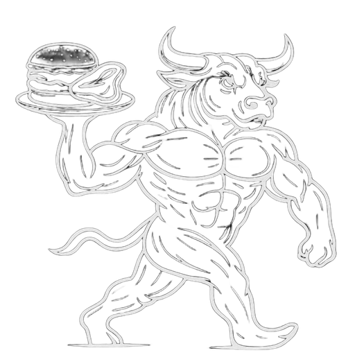
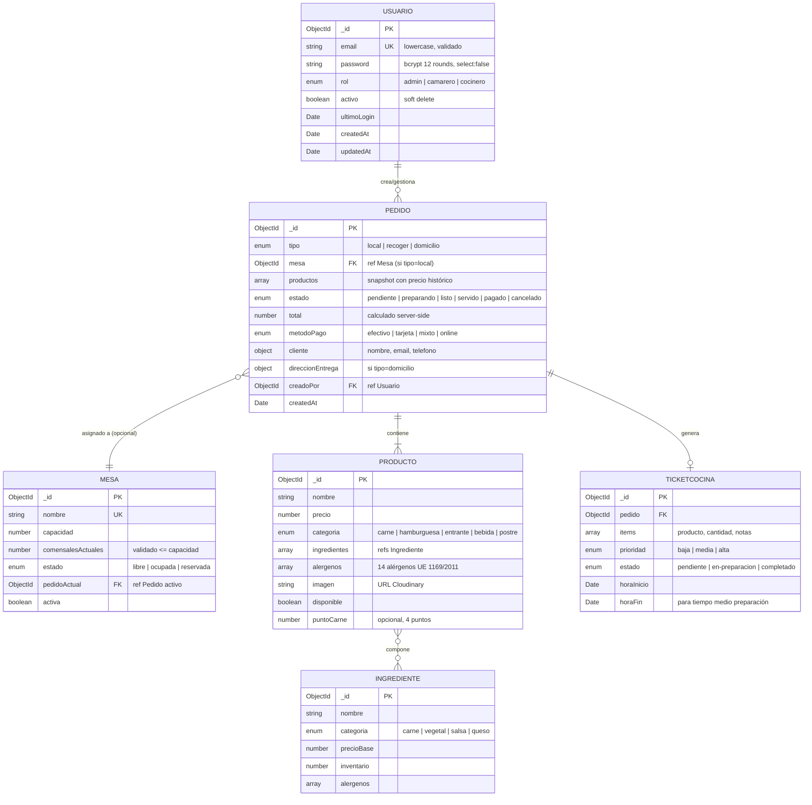

# MEMORIA DEL PROYECTO INTEGRADO

## El Buey Madurado — Transformación digital de un restaurante · hamburguesería gourmet

---

**Autor:** Michael Llorens Barbera
**Ciclo:** 2º DAW SEMI (semipresencial) — Desarrollo de Aplicaciones Web
**Curso:** 2025 / 2026
**Centro:** IES L'Estació (Ontinyent)
**Tutor:** Juan Torres Mancheño

**Empresa cliente:** Restaurante · Hamburguesería El Buey Madurado
**Dirección:** Calle Reina, 41 — Xàtiva (Valencia)
**Web en producción:** [www.restauranteelbueymadurado.com](https://www.restauranteelbueymadurado.com)
**Repositorio:** [github.com/Michael-Llorens/el-buey-madurado](https://github.com/Michael-Llorens/el-buey-madurado)

---

# Índice

1. [Resumen ejecutivo](#1-resumen-ejecutivo)
2. [Introducción y motivación](#2-introducción-y-motivación)
3. [Análisis del proyecto y requisitos](#3-análisis-del-proyecto-y-requisitos)
4. [Plan de empresa](#4-plan-de-empresa)
5. [Arquitectura y diseño técnico](#5-arquitectura-y-diseño-técnico)
6. [Modelo de datos](#6-modelo-de-datos)
7. [Funcionalidades del sistema](#7-funcionalidades-del-sistema)
8. [Sistema de autenticación y autorización](#8-sistema-de-autenticación-y-autorización)
9. [Integración de pagos (Stripe)](#9-integración-de-pagos-stripe)
10. [Seguridad](#10-seguridad)
11. [Tests y calidad de código](#11-tests-y-calidad-de-código)
12. [CI/CD y despliegue](#12-cicd-y-despliegue)
13. [Decisiones técnicas](#13-decisiones-técnicas)
14. [Cobertura de los RAs del PI](#14-cobertura-de-los-ras-del-pi)
15. [Conclusiones y trabajo futuro](#15-conclusiones-y-trabajo-futuro)
16. [Bibliografía](#16-bibliografía)
17. [Valoración personal del ciclo formativo](#17-valoración-personal-del-ciclo-formativo)
18. [Anexo A. Documentación de la API REST](#anexo-a-documentación-de-la-api-rest)

---

# 1. Resumen ejecutivo

**El Buey Madurado** es una aplicación web full-stack desarrollada como Proyecto Integrado del ciclo formativo *Desarrollo de Aplicaciones Web (2º DAW)*. Está implantada en un negocio **real y operativo**: un restaurante · hamburguesería gourmet situado en Xàtiva (Valencia), cuya página web y perfil de Google My Business gestiono personalmente.

La aplicación digitaliza la **operativa completa** del restaurante:

- **Cara al cliente final:** carta digital, pedidos online (recoger / domicilio), pagos con Stripe (tarjeta, Apple Pay, Google Pay) o pago al recoger, seguimiento de pedido en tiempo real, reservas, contacto.
- **Cara al equipo interno:** dashboard con gestión de mesas, panel de cocina en vivo (estilo Kanban), cobros con cálculo de cambio, reportes con métricas reales del negocio.
- **Sistema de roles** granular (admin / camarero / cocinero) con permisos aplicados en cada endpoint.

### Stack técnico

Next.js 16 (App Router) · React 19 · TypeScript 5.9 · MongoDB Atlas + Mongoose · `jose` (JWT) · Stripe · Cloudinary · GSAP + ScrollTrigger · SWR · Tailwind CSS · Vitest + Playwright · ESLint v9 · Docker · GitHub Actions · Vercel.

### Estado actual

| Métrica | Valor |
|---|---|
| TypeScript | 0 errores |
| ESLint | 0 errores |
| Tests automatizados | 71 / 71 passing |
| Documentación técnica | Completa |
| Despliegue | Web pública en producción (Vercel + dominio propio + Atlas); panel interno y pedidos online en fase de pruebas controladas con el equipo del restaurante |
| Cumplimiento OWASP Top 10 | Aplicado |

---

# 2. Introducción y motivación

## 2.1. Punto de partida

El Buey Madurado opera en un sector muy competitivo (hostelería premium), donde la digitalización marca cada vez más la diferencia entre los negocios que crecen y los que se estancan. Sin embargo, la mayoría de restaurantes de la zona siguen dependiendo de prácticas que generan fricciones evitables:

- Reservas por teléfono que solo funcionan en horario de apertura.
- Cartas en PDF o foto en redes, sin SEO, sin estructura y sin filtros.
- Plataformas terceras como Glovo o Uber Eats que se llevan entre un 25 % y un 30 % de comisión por cada pedido.
- Sistemas de cocina con tickets en papel propensos a errores.
- Decisiones de carta, horarios y stock tomadas sin métricas reales del negocio.

## 2.2. De dónde sale este proyecto

El Buey Madurado no es un cliente que apareció en una hoja de prácticas: **los propietarios son amigos míos de toda la vida**, gente del entorno de Xàtiva con la que llevo años. Vi cómo arrancaban el restaurante y, de primera mano, cómo se les iba el tiempo en cosas que la tecnología podía resolver. La idea de "podría hacerte una plataforma" empezó como una conversación informal y terminó convirtiéndose en este Proyecto Integrado.

Esa relación previa ha sido determinante para el resultado. Me ha permitido entrar a la cocina, hablar con el equipo, observar la operativa real y recibir feedback honesto cuando una decisión técnica no encajaba con el día a día del negocio. Sin ese acceso, este proyecto sería un ejercicio académico bien hecho; con él, ha podido aspirar a ser una herramienta de trabajo de verdad.

A partir de ahí me planteé construir una solución integral y a medida que:

1. Resolviera un problema real de un negocio real (no un caso de estudio teórico).
2. Aplicara de forma integrada lo aprendido en el ciclo: programación cliente/servidor, bases de datos, despliegue, diseño de interfaces y seguridad.
3. Fuera desplegable y mantenible a coste muy bajo, eligiendo tecnologías serverless con criterio.
4. Aportara valor tangible al cliente desde el primer día, reduciendo la dependencia de intermediarios y devolviendo al restaurante el control de su canal digital.

## 2.3. Objetivos del proyecto

| # | Objetivo | Estado |
|---|---|---|
| O1 | Diseñar e implementar una arquitectura full-stack escalable | ✅ Completado |
| O2 | Permitir pedidos online con pago real integrado (Stripe) | ✅ Completado |
| O3 | Soporte multi-rol (admin / camarero / cocinero) con permisos granulares | ✅ Completado |
| O4 | Vista en vivo para cocina con notificaciones | ✅ Completado |
| O5 | Despliegue automatizado y entornos separados | ✅ Completado |
| O6 | Tests automatizados y código tipado estrictamente | ✅ Completado |
| O7 | Diseño responsive con animaciones profesionales | ✅ Completado |

---

# 3. Análisis del proyecto y requisitos

## 3.1. Actores del sistema

| Actor | Función principal |
|---|---|
| 👤 **Cliente** | Consulta carta, hace pedido online, realiza pago, sigue su pedido en tiempo real |
| 👨‍💼 **Camarero** | Toma pedidos en mesa, cobra, cambia estados, gestiona reservas en sala |
| 👨‍🍳 **Cocinero** | Ve la cola de cocina en vivo, marca cada plato, gestiona ingredientes y stock |
| 👔 **Admin** | Todo lo anterior + reportes + gestión de usuarios + configuración global |

## 3.2. Requisitos funcionales

### Web pública (cliente final)
- Visualizar carta digital con filtros por categoría y búsqueda.
- Ver alérgenos UE (14 regulados) por producto.
- Añadir productos a carrito persistente (localStorage) con personalización (extras, sin ingredientes, notas).
- Realizar pedidos para recoger o entrega a domicilio.
- Pagar con tarjeta (Stripe), Apple Pay, Google Pay o pagar al recoger.
- Recibir confirmación con número de pedido.
- Seguir estado del pedido en tiempo real con barra animada.
- Reservar mesa con widget integrado.
- Contactar mediante formulario y WhatsApp.

### Dashboard interno (staff)
- Login seguro con persistencia de sesión.
- Gestión visual de mesas (estado libre/ocupada/reservada, capacidad, comensales).
- Toma y edición de pedidos en mesa.
- Cambio de estado del pedido (pendiente → preparando → listo → servido → pagado).
- Cobro con efectivo, tarjeta o pago mixto, con cálculo automático de cambio.
- Filtros, búsqueda y historial de pedidos.
- Notificación sonora al recibir pedidos nuevos.
- Vista Kanban de cocina con tiempos de espera (semáforo verde/amarillo/rojo).
- CRUD de productos (con imagen, ingredientes vinculados, precios extra, alérgenos).
- CRUD de ingredientes (con categoría, stock, alérgenos UE).
- CRUD de mesas (capacidad, comensales, estado).
- Reportes con métricas: ventas, productos top, evolución mensual, recaudación por turno.

## 3.3. Requisitos no funcionales

| # | Requisito | Implementación |
|---|---|---|
| RNF1 | Responsive (móvil, tablet, escritorio) | Tailwind CSS mobile-first |
| RNF2 | Performance — primera pintura < 2 s | Next.js + RSC + ISR + CDN Vercel |
| RNF3 | Seguridad OWASP Top 10 | JWT httpOnly, bcrypt 12 rounds, sanitización, rate limiting |
| RNF4 | Disponibilidad > 99 % | Vercel multi-región + MongoDB Atlas multi-AZ |
| RNF5 | Escalabilidad | Arquitectura serverless con auto-scaling |
| RNF6 | Mantenibilidad | TypeScript estricto + 71 tests automatizados + ESLint |
| RNF7 | Usabilidad | Animaciones GSAP, toasts Sonner, feedback inmediato |
| RNF8 | Accesibilidad | Semántica HTML, ARIA, contraste WCAG AA |
| RNF9 | Trazabilidad | Logger centralizado con niveles |
| RNF10 | Reproducibilidad | Docker + docker-compose con Mongo Express |

---

# 4. Plan de empresa

Esta sección desarrolla el plan de empresa, cubriendo los criterios de la rúbrica del módulo *Empresa e Iniciativa Emprendedora* (RA5, RA6, RA7). Para el detalle económico-financiero (inversión, costes, previsión de ingresos, punto de equilibrio, análisis de sensibilidad, ROI y riesgos) se recomienda consultar el documento independiente [`PLAN_EMPRESA.md`](./PLAN_EMPRESA.md), que acompaña a esta memoria como entrega complementaria.

## 4.1. Idea de negocio

**Restaurante · Hamburguesería El Buey Madurado** opera bajo una **doble identidad complementaria** que es a la vez su mayor activo de marca:

1. **Carnes premium maduradas:** cortes seleccionados de **vaca rubia gallega** (+45 días), **buey gallego** (+60 días) y **wagyu japonés** (Tajima-gyu), con maduraciones que pueden alcanzar los **500 días** en cortes especiales como la picaña de buey gallego.
2. **Hamburguesas gourmet:** elaboradas con la misma carne premium del restaurante, con producto estrella rotativo (la hamburguesa del mes "Los Cuñaos"). Esta línea actúa como puerta de entrada para captar nuevos clientes y como producto principal del canal de delivery.

Esta dualidad permite atender a **dos segmentos de mercado complementarios** sin perder coherencia de marca: ambas líneas comparten el mismo principio de producto premium y cuidado en la selección y preparación de la materia prima.

### El proyecto de transformación digital

El componente innovador del negocio es la **plataforma web full-stack** desarrollada a medida que digitaliza la operativa completa del restaurante. A diferencia de la mayoría de restaurantes que adoptan soluciones SaaS genéricas (CoverManager para reservas, Wuolah o similares para cartas, Glovo/UberEats para delivery), El Buey Madurado dispone de una **solución integral propia** que:

- **Refleja la identidad de marca** con paleta visual coherente, animaciones GSAP propias y tono comunicativo único.
- **Integra los principales puntos de contacto** del cliente: carta, reservas, pedidos, cobros y cocina en una sola plataforma.
- **Reduce la dependencia de comisiones de terceros** (Glovo/UberEats cobran entre 25-30 % por cada pedido), lo que permite al restaurante retener una parte mayor del margen generado por el canal directo.
- **Posee la base de datos de clientes y métricas operativas** como activo intangible valioso para futuras estrategias de marketing y mejora continua.

## 4.2. Problema real que resuelve

El sector de la hostelería en España, especialmente la hostelería premium en ciudades medias como Xàtiva, presenta una serie de **problemas operativos no resueltos** por las soluciones tradicionales:

| # | Problema actual del sector | Solución que aporta El Buey Madurado |
|---|---|---|
| 1 | Clientes necesitan llamar por teléfono o desplazarse para conocer la carta o reservar mesa | Carta digital accesible 24/7 desde cualquier dispositivo, con búsqueda y filtros |
| 2 | Pedidos para llevar o domicilio gestionados manualmente, propensos a errores | Sistema automatizado con pagos online y seguimiento en tiempo real |
| 3 | Cocina sin coordinación clara con sala (tickets en papel, ruido, errores de comunicación) | Panel Kanban en vivo, notificación sonora al recibir pedidos, semáforo de tiempo |
| 4 | Sin métricas reales: el propietario no sabe qué se vende mejor, en qué horas, qué turnos rinden | Módulo de reportes con agregaciones de MongoDB sobre datos reales del negocio |
| 5 | Dependencia de plataformas terceras que cobran 25-30 % de comisión por pedido | Sistema propio que evita comisiones de intermediarios |
| 6 | Imposibilidad de personalización profunda del producto (extras, sin ingredientes, punto de carne) | Modal interactivo de personalización con 4 puntos de carne diferenciados visualmente |
| 7 | Cumplimiento manual y propenso a olvidos del Reglamento UE 1169/2011 (alérgenos) | Validación automática de los 14 alérgenos UE en cada producto |

## 4.3. Presentación del promotor

**Michael Llorens Barbera**
*Desarrollador full-stack en formación · Estudiante de 2º DAW*

### Trayectoria formativa

Mi camino al desarrollo no ha sido lineal, pero sí coherente. Después de la **ESO** accedí a la Formación Profesional por la **vía de la prueba de acceso a ciclos formativos de grado superior**, sin pasar por bachillerato. Mi primer ciclo fue el **Grado Superior de Desarrollo de Aplicaciones Multiplataforma (DAM)**, que finalicé el curso pasado (2024/2025). Allí me especialicé en aplicaciones móviles y multiplataforma, programación orientada a objetos, bases de datos relacionales y desarrollo de interfaces.

Este curso (2025/2026) estoy cursando un **segundo Grado Superior**: el de **Desarrollo de Aplicaciones Web (DAW)** en modalidad **SEMI (semipresencial)** en el **IES L'Estació de Ontinyent**. La elección de DAW tras DAM no fue casual: quería completar mi perfil con la parte web full-stack (frontend moderno, backend con Node, despliegue en cloud) que el ciclo anterior solo tocaba parcialmente. La modalidad semipresencial me ha permitido compatibilizar la formación con el trabajo en proyectos reales como este, y refleja mi forma de enfocar el aprendizaje: prefiero llegar al desarrollo profesional por el camino más directo posible, aplicando lo que aprendo a proyectos concretos en lugar de quedarme en ejercicios teóricos.

### Idiomas y competencias transversales

| Ámbito | Detalle |
|---|---|
| **Idiomas** | Español (nativo), valenciano (nativo), inglés técnico aplicado a documentación y stack. |
| **Autoaprendizaje** | Adopción autónoma de tecnologías recientes (Next.js 16, React 19, GSAP, Stripe) y aplicación a contexto real. |
| **Trabajo en equipo** | Comunicación directa con el equipo del restaurante, recogida de feedback operativo e iteración sobre necesidades reales. |
| **Orientación a producto** | Decisiones técnicas guiadas por valor de negocio: prioridad a usabilidad, fiabilidad y mantenibilidad frente a sobreingeniería. |
| **Gestión de proyecto** | Planificación por fases, documentación técnica, control de versiones, CI/CD y despliegue en producción. |

### Contacto profesional

- **GitHub:** [@Michael-Llorens](https://github.com/Michael-Llorens) — historial de commits, CI/CD y documentación técnica verificables.
- **Email corporativo del cliente:** elbueymaduradoxativa@gmail.com

### Perfil profesional resumido

Desarrollador con perfil técnico orientado al stack JavaScript moderno (React, Next.js, TypeScript, Node.js, MongoDB). Capacidad demostrada para construir aplicaciones full-stack de principio a fin, desde el modelado de datos hasta el despliegue en producción con pipeline de CI/CD automatizado.

Experiencia técnica demostrada en este proyecto:
- Arquitectura de aplicaciones serverless en Vercel.
- Integración con servicios de pagos (Stripe) y almacenamiento (Cloudinary).
- Seguridad web aplicada (JWT, bcrypt, rate limiting, validación de entrada, OWASP Top 10).
- Tests automatizados (Vitest, Playwright).
- Documentación técnica y plan de empresa estructurado.
- Gestión del perfil de Google My Business del cliente real.

### Currículum resumido del promotor

A modo de síntesis profesional, esta es la ficha curricular del autor del proyecto:

| Apartado | Datos |
|---|---|
| **Nombre completo** | Michael Llorens Barbera |
| **Rol en el proyecto** | Promotor, desarrollador full-stack, gestor del canal digital y del perfil de Google Business del restaurante |
| **Formación previa** | Grado Superior de Desarrollo de Aplicaciones Multiplataforma (DAM) — finalizado en 2024/2025 |
| **Formación actual** | 2.º curso de Grado Superior de Desarrollo de Aplicaciones Web (DAW SEMI · semipresencial) — IES L'Estació, Ontinyent |
| **Vía de acceso a FP Superior** | Prueba de acceso a ciclos formativos de grado superior (tras la ESO) |
| **Vía de acceso** | Prueba de acceso a ciclos formativos de grado superior |
| **Idiomas** | Español (nativo), valenciano (nativo), inglés técnico aplicado a documentación, stack y comunicación profesional |
| **Stack técnico dominado** | Next.js 16, React 19, TypeScript, Tailwind CSS, GSAP, Node.js, MongoDB, Mongoose, Stripe, Cloudinary, Vercel, Docker, GitHub Actions |
| **Áreas de especialización** | Aplicaciones full-stack con stack JavaScript moderno, seguridad web (OWASP), integración de pagos online, despliegue serverless y CI/CD |
| **Soft skills clave** | Autoaprendizaje continuo, trabajo con cliente real, comunicación con equipos no técnicos, gestión de proyecto por fases |
| **Experiencia destacada** | Plataforma full-stack en producción para El Buey Madurado (web pública en uso real + panel interno y pedidos online en pruebas controladas) |
| **Repositorio y porfolio** | [github.com/Michael-Llorens](https://github.com/Michael-Llorens) — código abierto, CI/CD, documentación técnica |
| **Objetivo profesional** | Especializarme en digitalización de PYMES de hostelería y comercio local mediante plataformas a medida |

## 4.4. Identidad de marca

### Nombre

**El Buey Madurado** comunica exactamente lo que el restaurante ofrece en tres palabras:
- **"Buey"** — animal premium, asociado a calidad superior frente a otros tipos de carne.
- **"Madurado"** — proceso técnico distintivo que aporta valor (sabor, terneza, propiedades organolépticas únicas).
- **"El"** — artículo determinado que aporta carácter y proximidad ("el" lugar, no "un" lugar).

Es fácil de recordar (tres palabras, fonética castellana), diferenciador (no es genérico), y buscable (SEO natural — quien busque "buey madurado xàtiva" llega directo).

### Logo

El logo combina tipografía heading negra (uppercase, alta presencia visual), iconografía sutil asociada al corte de carne, y una paleta dorada/ámbar sobre fondo oscuro que transmite premium, profundidad y elegancia.


*Figura 0: Logotipo oficial del restaurante. Paleta dorada/ámbar sobre fondo oscuro.*

**Archivos oficiales del logotipo en el repositorio:**

| Recurso | Ubicación en el repositorio | Uso |
|---|---|---|
| Logo en alta resolución | `public/icons/icon-512.png` | Comunicación principal, redes sociales, cartelería |
| Logo PWA estándar | `public/icons/icon-192.png` | Instalación de la web como aplicación |
| Logo PWA maskable | `public/icons/icon-maskable-512.png` | Iconos adaptables Android |
| Favicon | `public/logo-fondo-blanco.ico` | Pestaña del navegador |

> **Nota:** en la versión final en PDF de esta Memoria se incluirá una reproducción del logotipo en la portada y al inicio de esta sección.

**Coherencia visual aplicada en toda la plataforma:**
- Color principal: **amber-500/600** (#d97706) — dorado-ámbar, asociado a parrilla, brasa, lujo.
- Color fondo: **#160a00** — marrón muy oscuro, casi negro, asociado a interior de restaurante de calidad.
- Acentos: tonos rojos (#dc2626) para puntos de carne, verdes esmeralda (#10b981) para confirmaciones.

### Arquitectura de mensajes (4 eslóganes)

El restaurante utiliza **cuatro mensajes diferenciados** según el canal y el momento del cliente, creando una identidad rica sin perder coherencia:

| Mensaje | Función | Canal principal |
|---|---|---|
| *"No hablamos de comida rápida… hablamos de alta cocina"* | Eslogan principal — posicionamiento defensivo frente a confusión "hamburguesería = fast food" | Hero de la web |
| *"No es delivery, es experiencia gastronómica"* | Eslogan delivery — refuerza que el producto no se compromete por el canal | Sección de pedidos online |
| *"La carne no se explica, se respeta"* | Mantra de marca — manifiesto interno | Sobre nosotros |
| *"Cuñao, prueba esto que vas a flipar"* | Tono cercano — conecta con público local valenciano | Redes sociales, productos estrella |

Esta arquitectura de mensajes permite **hablar a cada cliente en su lenguaje** sin desviarse de la identidad: el foodie recibe "alta cocina", el joven urbano recibe "Cuñao", el cliente a domicilio recibe "experiencia gastronómica".

### Valores corporativos

Los valores se enuncian como **principios verificables** en la operativa del restaurante y del proyecto digital, no como discurso de marketing. Cada valor se traduce en decisiones concretas:

| Valor | Cómo se materializa |
|---|---|
| **Calidad sin atajos** | Carne de Cárnicas LYO con maduraciones de hasta 500 días; sin ultraprocesados. |
| **Cercanía local** | WhatsApp Business, tono cercano en redes, apoyo a festividades de Xàtiva. |
| **Transparencia** | Alérgenos UE visibles, precios sin recargos ocultos, seguimiento de pedido en vivo. |
| **Innovación útil** | Plataforma propia para evitar comisiones de marketplaces; reportes para decidir con datos. |
| **Respeto al producto y al equipo** | Trazabilidad visible, relación a largo plazo con proveedores locales, formación interna del staff. |
| **Honestidad profesional** | No prometer experiencia idéntica en delivery: el eslogan reconoce que es "experiencia en casa", no la de sala. |

## 4.5. Análisis del entorno (PESTEL completo)

### Político-Legal

- **Normativa de hostelería** estricta en Comunitat Valenciana: licencias de actividad, manipulación de alimentos, **Reglamento UE 1169/2011** (información obligatoria sobre alérgenos — los 14 declarados están implementados en la app).
- **Política fiscal:** IVA reducido al **10 % en restauración** (frente al 21 % general). Pago de impuestos sobre actividades económicas.
- **Políticas activas de creación y digitalización de empresas:**
  - **Kit Digital** — bonos de hasta 12.000 € por PYME financiados con fondos NextGenerationEU, con categorías ("Sitio web", "Comercio electrónico", "Gestión de procesos") en las que este proyecto encaja directamente.
  - **Tarifa plana de autónomos** — 80 €/mes durante los primeros 12 meses (Ley 6/2017) para nuevos autónomos.
  - **Ayudas autonómicas valencianas** (AVALEM Joves+, IVF — Institut Valencià de Finances) y líneas ICO Empresas para financiación inicial.

### Económico

**Contexto internacional:**
- La **Eurozona** crece a ritmo moderado (≈ 0,8-1,5 % anual según previsiones BCE), con presiones inflacionarias derivadas del coste energético y de tensiones geopolíticas que encarecen materias primas globales.
- **Política monetaria del BCE:** tipos de interés en torno al **2,5-3 %** tras los recortes de 2024-2025; encarece la financiación bancaria pero modera la demanda interna.
- **Mercados internacionales:** EE. UU. y China continúan dictando el precio de muchas materias primas. La fortaleza relativa del euro afecta directamente al coste de importaciones como el wagyu japonés.

**Contexto nacional:**
- **Inflación en España (2024-2025):** 3-4 % anual, con un IPC de alimentación habitualmente por encima de la media, que presiona los márgenes en hostelería.
- **Coste de materia prima en alza:** la carne de calidad (vaca rubia gallega, wagyu) ha subido entre **15 % y 25 % en los últimos 3 años**, en parte por la inflación importada.
- **PIB sectorial:** la hostelería representa aproximadamente el **5 % del PIB español** y emplea a **1,9 millones de personas** (datos INE).
- **Tasa de paro nacional:** próxima al **11 %**, con dificultad creciente para contratar personal cualificado de sala y cocina, factor crítico para restaurantes premium.
- **Renta disponible:** Xàtiva mantiene una renta media por hogar próxima a los **22.000 €**, suficiente para sostener gasto en gastronomía premium con frecuencia controlada.

### Sociocultural

- **Auge del "slow food" y producto local:** consumidor cada vez más informado, valora trazabilidad y maduración.
- **Cultura del foodie y redes sociales:** Instagram y TikTok son escaparates clave (un buen plato fotografiado equivale a publicidad gratuita).
- **Cambio generacional:** millennials y Generación Z buscan **experiencias gastronómicas**, no solo comida.
- **Demanda creciente de canales digitales:** según ABEX (2024), **el 67 % de españoles ha hecho un pedido online de comida en el último mes**.

### Tecnológico

- **Adopción masiva del smartphone:** España tiene una penetración del **95 % en menores de 65 años**.
- **Pagos contactless / digital wallets:** Apple Pay, Google Pay, Bizum se han normalizado (más del 60 % de pagos en hostelería ya son contactless).
- **Cloud y serverless:** plataformas como Vercel + MongoDB Atlas democratizan el despliegue de aplicaciones a coste muy bajo.
- **IA generativa:** ChatGPT, Gemini, Claude están entrando en hostelería para recomendaciones personalizadas, chatbots, etc. (oportunidad futura).

### Ecológico

- **Sensibilidad al bienestar animal:** el consumidor exige proveedores éticos (en la web del restaurante ya se destaca como valor de marca).
- **Reducción de packaging:** envases biodegradables para domicilio (futuro requisito).
- **Huella de carbono:** sectores premium pueden capitalizar la trazabilidad como diferencial.

### Legal específico

- **RGPD:** obligatorio para gestionar datos de clientes (formulario de reservas, pedidos online).
- **PSD2 / SCA:** autenticación reforzada en pagos online — Stripe lo gestiona automáticamente.
- **PCI-DSS:** los datos de tarjeta nunca pasan por nuestro servidor (Stripe Elements iframe garantiza el cumplimiento).

## 4.6. Análisis de la competencia

### Tipos de competidores en Xàtiva y comarca

| Tipo de competidor | Perfil | Fortalezas típicas | Debilidades típicas |
|---|---|---|---|
| **Restaurante tradicional local** | Cocina mediterránea o regional valenciana con años en la zona | Reputación local consolidada, clientela fiel, conocimiento del cliente | Web básica o inexistente, sin pedido online, sin presencia digital fuerte |
| **Hostelería de hotel** | Restaurante asociado a hotel u hostal de la zona | Flujo turístico cautivo, ubicación, infraestructura | Carta poco diferenciada, perfil generalista, sin canal digital propio |
| **Restaurante de cocina mediterránea generalista** | Ofrece variedad sin diferencial claro | Versatilidad de carta, terraza, ubicación | No especialización en carne premium, sin diferenciador, ticket medio |
| **Cadena regional de asadores/carnes** | Cadenas con presencia en zonas cercanas | Marca reconocida, web profesional, marketing centralizado | Producto no local, decisiones desde central lejana, falta personalización |

### Diferenciación de El Buey Madurado

- **vs Restaurante tradicional local:** mantenemos el carácter local pero añadimos canal digital propio y producto especializado (no generalista).
- **vs Hostelería de hotel:** somos destino gastronómico por mérito propio, no escala turística incidental.
- **vs Cocina mediterránea generalista:** especialización clara en carne madurada premium + hamburguesa gourmet.
- **vs Cadena regional:** producto local + atención personal + sin decisiones tomadas desde una central a 500 km.

### Mapa del proceso de compra: comparativa con la competencia

| Touchpoint del cliente | Competencia típica | El Buey Madurado |
|---|---|---|
| 🔍 Descubrimiento (búsqueda online) | Sitio web estático básico, sin SEO específico | Landing animada con GSAP, SEO trabajado, reseñas Google integradas |
| 📖 Consulta de carta | PDF descargable o foto en redes | Carta digital interactiva con filtros, alérgenos, búsqueda |
| 🪑 Reserva | Llamada telefónica solo en horario de apertura | Widget integrado 24/7 + WhatsApp directo |
| 🛒 Pedido online | No existe / vía Glovo (25 % comisión) | Sistema propio con carrito persistente y personalización |
| 💳 Pago | Solo en local | Stripe online + opción "pagar al recoger" |
| 🔔 Seguimiento | Hay que llamar | Página de tracking en vivo con barra animada |
| 🍽️ Experiencia en sala | Comanda en papel | Camarero con tablet, cocina ve pedidos en tiempo real |
| 💰 Cobro | Caja registradora tradicional | Cobro digital con cálculo automático de cambio |
| 📊 Post-venta | Sin seguimiento | Datos para reportes y marketing futuro |

**Conclusión del análisis competitivo:** El Buey Madurado se diferencia a lo largo de todo el funnel digital. Buena parte de la competencia local ofrece una experiencia gastronómica de calidad comparable, pero en el momento de redactar esta memoria no se identifica un competidor cercano que combine ese mismo nivel de producto con una plataforma digital integrada propia de extremo a extremo. Esto abre una ventaja competitiva relevante para captar al cliente joven, urbano y digitalizado, aunque conviene tratarla como ventaja de adopción temprana, no como ventaja permanente.

## 4.7. Análisis DAFO con estrategias

### 🟢 Fortalezas (internas)

| F | Descripción | Estrategia para potenciar |
|---|---|---|
| **F1** | Producto premium con identidad clara (vaca rubia gallega, buey gallego, wagyu A5) | Comunicación constante en redes sociales con vídeo del proceso de maduración |
| **F2** | Plataforma digital propia sin dependencia de terceros | Posicionamiento como "restaurante digital nativo" en la zona |
| **F3** | Equipo joven y emprendedor con perfil técnico integrado | Cultura de innovación constante, iteraciones rápidas |
| **F4** | 5.0 estrellas en Google con más de 55 reseñas verificadas | Mostrar el rating como social proof en toda la web y publicidad |
| **F5** | Ubicación en Calle Reina, 41 — Xàtiva, ciudad con patrimonio cultural (Castell) y afluencia turística | Aprovechar la afluencia turística y la falta de oferta especializada |
| **F6** | Coste tecnológico bajo (Vercel + MongoDB Atlas en tier gratis para iniciar) | Margen libre para invertir en marketing y producto |

### 🔴 Debilidades (internas)

| D | Descripción | Estrategia para mitigar |
|---|---|---|
| **D1** | Ticket medio alto en carnes premium limita frecuencia de compra | Lanzar hamburguesas premium como puerta de entrada |
| **D2** | Dependencia de proveedores específicos (Cárnicas LYO) | Plan B con proveedor secundario para no quedar sin stock |
| **D3** | Equipo de cocina reducido — escalabilidad limitada | Sistema de tickets de cocina en vivo optimiza la operativa actual |
| **D4** | Marca aún poco conocida fuera de Xàtiva | Inversión en redes sociales + colaboraciones con foodies locales |
| **D5** | Tecnología requiere mantenimiento (alguien tiene que ocuparse) | Documentación técnica detallada y CI/CD para mantenimiento sostenible |

### 🟡 Oportunidades (externas)

| O | Descripción | Estrategia para aprovechar |
|---|---|---|
| **O1** | Crecimiento del delivery premium (post-pandemia consolidado) | Optimizar canal domicilio: empaquetado, tiempos, zonas |
| **O2** | Subvenciones Kit Digital para hostelería | Solicitar ayuda para acelerar inversión en marketing |
| **O3** | Auge del turismo gastronómico en Valencia | Posicionarse en Tripadvisor / Google Maps como referencia |
| **O4** | Mercado de eventos privados (cumpleaños, reuniones de empresa) | Sección de "eventos" en la web + paquetes cerrados |
| **O5** | Foodies en redes sociales buscando contenido auténtico | Programa de colaboraciones con influencers gastronómicos |
| **O6** | IA generativa para recomendaciones de maridaje, chatbot atención al cliente | Roadmap a 1 año para integrar IA en la experiencia |

### ⚫ Amenazas (externas)

| A | Descripción | Estrategia de mitigación |
|---|---|---|
| **A1** | Inflación de materia prima (carne premium +15-25 % en 3 años) | Repercusión gradual de precios + comunicación de valor |
| **A2** | Llegada de cadenas premium a la zona (Goiko, Briketenia, etc.) | Reforzar carácter local, producto, tradición — algo que las cadenas no pueden replicar |
| **A3** | Cambio de hábitos (más comida saludable, menos carne roja) | Diversificar carta con opciones más ligeras sin perder identidad |
| **A4** | Crisis económica que reduzca gasto en hostelería premium | Mantener línea de hamburguesas asequibles como suelo del negocio |
| **A5** | Riesgo tecnológico: caída de Vercel, Stripe o MongoDB Atlas | Sistema con fallbacks (carta estática), backups automáticos, plan de continuidad |
| **A6** | Competencia de plataformas globales (Glovo, UberEats) con marketing agresivo | Convertir la "no dependencia" en argumento de venta directo al cliente |

### Matriz cruzada DAFO — estrategias

| | Oportunidades | Amenazas |
|---|---|---|
| **Fortalezas** | F2 + O2: usar Kit Digital para amplificar la ventaja tecnológica que ya tenemos | F4 + A2: defender posición ante cadenas con social proof (5.0 en Google) |
| **Debilidades** | D1 + O3: lanzar productos puerta de entrada para captar turismo gastronómico | D4 + A2: invertir en branding local antes de que entren cadenas |

## 4.8. Mercado objetivo y segmentación

### Definición del mercado

El Buey Madurado opera en el mercado de la **restauración premium especializada** en Xàtiva y comarca (~30 km), con extensión digital a toda La Costera y La Vall d'Albaida vía pedidos a domicilio.

### Tamaño potencial del mercado

- **Población Xàtiva:** ≈30.000 habitantes.
- **Población comarca (La Costera):** ≈70.000 habitantes.
- **Zona de delivery (30 min en coche):** ≈150.000 habitantes.
- **Turismo anual Xàtiva:** ≈300.000 visitantes (Castell de Xàtiva, festividades).

### Segmentación con perfiles psicográficos

**Segmento 1: 🍷 El Foodie Local (cliente fundacional)**

| Atributo | Detalle |
|---|---|
| Demográfico | 30-55 años, renta media-alta, residente en Xàtiva o comarca |
| Psicográfico | Apasionado por la gastronomía, comparte en Instagram, sigue food bloggers, considera el comer una "experiencia" |
| Necesidades | Producto excepcional, experiencia memorable, ambiente cuidado, atención personalizada |
| Comportamiento | Frecuencia 1-2 veces/mes, ticket alto (50+ €/persona), viene en pareja o pequeño grupo |
| Justificación | Es la base del negocio; compra por convicción, no por precio |

**Segmento 2: 🍔 El Joven Urbano (oportunidad de crecimiento)**

| Atributo | Detalle |
|---|---|
| Demográfico | 20-32 años, urbano, smartphone-first |
| Psicográfico | Decisión guiada por reseñas online, fotos, redes sociales, sigue tendencias |
| Necesidades | Hamburguesa premium asequible, pedido fácil online, ambiente Instagram-friendly |
| Comportamiento | Frecuencia 2-4 veces/mes, ticket medio (18-25 €), pide online o viene en grupo |
| Justificación | Permite rotación alta, crea presencia en redes, es ticket de entrada para futuros clientes premium |

**Segmento 3: 🏢 El Profesional / Empresa (volumen)**

| Atributo | Detalle |
|---|---|
| Demográfico | 35-55 años, profesional liberal o empresa local, alta capacidad de gasto |
| Psicográfico | Valora discreción, eficiencia, calidad consistente, relación calidad/precio justa |
| Necesidades | Comida de trabajo, eventos privados, reserva sencilla, factura |
| Comportamiento | Frecuencia semanal o quincenal en comidas de trabajo |
| Justificación | Margen alto, estabilidad de ingresos, prescripción gratuita en su círculo profesional |

**Segmento 4: 🛵 El Cliente a Domicilio (mercado digital)**

| Atributo | Detalle |
|---|---|
| Demográfico | 25-50 años, vive en Xàtiva o pueblos cercanos |
| Psicográfico | Quiere experiencia premium en casa, evita salir entre semana, no quiere usar Glovo |
| Necesidades | Hamburguesa o entrante premium, llegada caliente, pago fácil online |
| Comportamiento | Frecuencia 1-2 veces/mes, ticket medio 25-35 € |
| Justificación | Nuevo canal habilitado por la plataforma; mercado en crecimiento |

### Mapa del proceso de compra del cliente (Customer Journey)

Para diseñar la propuesta de valor con criterio, se ha analizado el **recorrido completo del cliente** desde que conoce el restaurante hasta que repite y recomienda.

| Fase | Touchpoint principal | Lo que vive el cliente | Lo que aporta El Buey Madurado |
|---|---|---|---|
| **1. Descubrimiento** | Google Maps, redes sociales, recomendación. | "He oído hablar de este sitio, investigo." | Google Business gestionado, reseñas 5,0 ★, contenido visual propio. |
| **2. Investigación** | Web propia (`restauranteelbueymadurado.com`). | "Quiero ver carta, local, reseñas, decidir." | Web rápida, carta digital, sección "Sobre nosotros" con historia. |
| **3. Decisión** | Carta, precios, alérgenos, ubicación. | "¿Cuadra el precio? ¿Hay alérgenos visibles?" | Precios claros, alérgenos UE por plato, fotos reales. |
| **4. Reserva** | Widget CoverManager / WhatsApp Business. | "Quiero reservar sin llamar." | Reserva online 24/7 con confirmación inmediata. |
| **5. Anticipación** | Recordatorio + redes. | "Espero con ganas, lo comento con quien viene." | Recordatorios automáticos, contenido aspiracional. |
| **6. Experiencia en sala** | Local, equipo, plato, atención. | "Que la realidad esté a la altura." | Producto premium, atención cercana, dashboard que ayuda al equipo. |
| **7. Pedido online (alternativa)** | Web → carrito → checkout. | "Quiero la misma calidad en casa." | Pedido directo, personalización, Stripe, seguimiento en vivo. |
| **8. Pago** | TPV en sala o Stripe online. | "Que sea rápido, claro y sin sorpresas." | Cobro con cálculo automático de cambio o Stripe sin recargo. |
| **9. Postventa** | Reseñas, redes, recomendación. | "Quiero contar lo que me ha pasado." | Gestión activa de reseñas, agradecimiento personalizado. |
| **10. Fidelización** | Repetición y referidos. | "Vuelvo y traigo a alguien." | Promociones tácticas (Madurado Tour, descuento primer pedido online), datos propios para futuras acciones. |

La plataforma cubre cada fase con una herramienta concreta. Donde la competencia falla habitualmente (bloque digital: fases 2-4 y 7-8) es donde la propuesta se diferencia.

## 4.9. Propuesta de valor única (UVP)

> **"En El Buey Madurado disfrutas de carne premium madurada hasta 500 días, con la experiencia gastronómica de un restaurante y la comodidad digital de una app moderna — sin intermediarios, sin comisiones extra y con la garantía de un negocio local que cuida cada detalle."**

### Los tres pilares de la propuesta

1️⃣ **Producto: carne madurada premium**
- Vaca rubia gallega +45 días.
- Buey gallego +60 días.
- Wagyu Tajima-gyu seleccionado.
- Procesos artesanales con Cárnicas LYO.

2️⃣ **Experiencia: gastronomía + tecnología sin fricción**
- Carta digital con búsqueda y filtros.
- Personalización por plato (extras, sin ingredientes, punto de carne con 4 opciones diferenciadas visualmente).
- Reserva 24/7 sin llamadas.
- Seguimiento de pedido en tiempo real con barra animada.
- Pago al gusto: online, al recoger o al recibir.

3️⃣ **Modelo: directo y local**
- 0 % de comisión a intermediarios.
- El propietario captura el 100 % del valor por cada pedido.
- Decisiones basadas en datos propios del negocio.
- Producto local, atención local, beneficio local.

## 4.10. Estrategias de marketing (4P)

### Producto 🥩

- **Carnes premium en sala** (chuletón, lomo alto, lomo bajo, wagyu): producto estrella, margen alto.
- **Hamburguesas premium**: ticket más accesible, rotación alta, ideal para captar nuevos clientes y delivery.
- **Entrantes y postres**: complemento de ticket medio.
- **Bebidas**: vinos seleccionados con maridaje, cervezas artesanas, refrescos, aguas.

**Características diferenciales del producto:**
- **Personalización completa**: el cliente decide punto de la carne, ingredientes extra, ingredientes a remover y notas para cocina.
- **Trazabilidad visible**: cada producto lleva información de procedencia, raza y maduración en la carta.
- **Alérgenos UE**: los 14 alérgenos visibles en cada plato (cumplimiento Reglamento 1169/2011).
- **Fotografía profesional** servida vía Cloudinary CDN para carga rápida.
- **Empaquetado premium para domicilio** (caja con isotermo, bolsa de marca).

### Precio 💰

| Estrategia | Detalle |
|---|---|
| **Precio premium en sala** | Acorde al producto y experiencia (ticket medio 35-50 €/persona en menú de carnes) |
| **Precio accesible en hamburguesas** | 15-18 € como puerta de entrada para nuevos clientes |
| **Sin recargo por pedido online** | Incentiva el canal directo y la captura del cliente digital |
| **Gastos de envío fijos** | 3,50 € — transparencia total con el cliente |

**Justificación:** el producto justifica el precio (no se compite por precio, se compite por valor). El modelo digital ahorra comisiones de terceros del 25-30 %, lo que permite mantener calidad sin subir precios. Pago flexible (tarjeta online, efectivo al recoger, contraentrega) reduce fricción.

### Plaza / Distribución 🛵

| Canal | Descripción | % esperado de ventas |
|---|---|---|
| **Sala** | Comer en el restaurante en Xàtiva | 60 % |
| **Recoger** | Pedido online, recogida en local | 25 % |
| **Domicilio propio** | Reparto en Xàtiva y comarca (zona ≈10 km) con repartidor propio | 15 % |
| **Eventos privados** | Cumpleaños, comidas de empresa, etc. | Canal futuro |

**Ubicación física:** Calle Reina, 41 — Xàtiva. Ciudad con patrimonio histórico (Castell de Xàtiva), afluencia turística estable y población local con buena renta media.

**Canal digital:** web propia (`www.restauranteelbueymadurado.com`), WhatsApp Business para reservas urgentes, redes sociales como prescriptor (Instagram, TikTok).

### Promoción 📢 (4 promociones concretas)

**🎯 Promoción 1: "Madurado Tour" — Menú degustación digital**
- **Qué:** menú degustación de 5 cortes diferentes (vaca rubia 30/45/60 días + wagyu) maridado con vinos.
- **Cuándo:** jueves de cada mes (día de menor afluencia).
- **Cómo:** reserva exclusiva online vía la web.
- **Precio:** 65 €/persona (vs 90+ € si se pidieran por separado).
- **Objetivo:** generar contenido para redes (clientes haciendo fotos del "tour"), captar foodies, llenar el día débil.

**🎯 Promoción 2: "Pide y disfruta" — Descuento por pedido online**
- **Qué:** 10 % de descuento en el primer pedido online a domicilio o recoger.
- **Cómo:** código QR en la entrada del local, en redes sociales y en cartelería.
- **Cuándo:** durante 3 meses tras el lanzamiento de la plataforma.
- **Objetivo:** educar al cliente para que use el canal digital propio (sin comisiones de terceros).
- **Ejecución técnica:** cupón gestionado desde el dashboard con el campo `descuento` ya existente en el modelo Pedido.

**🎯 Promoción 3: "Buey Influencer" — Programa de colaboraciones**
- **Qué:** invitar a 1 foodie/mes (Instagram >10k seguidores en gastronomía valenciana) a una comida gratis.
- **A cambio:** post dedicado en Instagram + reseña en blog/web.
- **Coste:** ~80 € por colaboración × 12 meses = **960 €/año** (vs >5.000 € por campaña tradicional con mismo alcance).
- **Métrica:** tracking de visitas a la web tras cada post.

**🎯 Promoción 4: "Tu mesa siempre lista"**
- **Qué:** sistema de reservas online sin pago previo, con recordatorio por WhatsApp 24 h antes.
- **Por qué importa:** reduce no-shows (clientes que reservan y no aparecen — un problema crónico en hostelería).
- **Métrica:** comparar % de no-shows antes/después de la implementación.

### Publicidad

| Canal | Inversión mensual | Alcance esperado |
|---|---|---|
| Instagram orgánico | 0 € (tiempo) | Audiencia local fiel, alta engagement |
| Instagram Ads (segmentado por código postal) | 100-150 € | 5.000-10.000 impresiones locales |
| Google Ads (búsquedas "restaurante carne xàtiva") | 80-120 € | Clientes con intención clara de compra |
| Reseñas Google (gestión activa) | 0 € | Posicionamiento orgánico |
| Folletos en hoteles locales | 40 € | Captación de turistas |

### Relaciones públicas

- **Colaboración con festividades locales** (Feria de Agosto de Xàtiva, fiestas patronales).
- **Notas de prensa** a medios locales (Levante-EMV, Las Provincias) sobre el lanzamiento de la plataforma digital como caso de innovación.
- **Catas exclusivas** para periodistas gastronómicos (1-2 al año).

## 4.11. Plan de sostenibilidad: aspectos ASG y alineación con los ODS

El plan de sostenibilidad del proyecto se estructura en torno al marco **ASG** (Ambiental, Social y de Gobernanza), que permite identificar los aspectos materiales del negocio y definir acciones concretas para gestionarlos y medirlos. Esta estructura se complementa con la alineación con los **Objetivos de Desarrollo Sostenible** de la Agenda 2030.

### Aspectos ASG materiales y grupos de interés

| Grupo de interés | Aspectos materiales identificados |
|---|---|
| **Clientes** | Información de alérgenos, seguridad de pagos, protección de datos personales, transparencia de precios |
| **Equipo del restaurante** | Empleo local estable, formación digital, ergonomía del trabajo con el dashboard |
| **Proveedores locales** | Continuidad de la relación comercial, condiciones de pago, trazabilidad |
| **Entorno** | Reducción de merma alimentaria, packaging biodegradable, huella energética del cloud |
| **Comunidad de Xàtiva** | Empleo local, dinamización gastronómica, presencia en festividades y vida cultural |

### Acciones concretas de gestión ASG

| Pilar ASG | Acción del proyecto | Indicador de seguimiento |
|---|---|---|
| **Ambiental (A)** | Reportes de stock y previsión de demanda para reducir merma alimentaria | Kg de merma mensual |
| **Ambiental (A)** | Carta digital que elimina cartas impresas y permite actualizar precios sin reimprimir | Hojas de papel evitadas al año |
| **Ambiental (A)** | Plan de transición a packaging biodegradable en domicilio | % de pedidos en packaging biodegradable |
| **Ambiental (A)** | Proveedores cloud escalables según uso, sin sobredimensionamiento de infraestructura | Coste cloud mensual / pedidos atendidos |
| **Social (S)** | Validación automática de los 14 alérgenos UE (Reglamento 1169/2011) | Incidencias de alergias / reclamaciones |
| **Social (S)** | Empleo local en Xàtiva y formación digital del personal en el uso del dashboard | Personas empleadas / horas formación |
| **Social (S)** | Proveedores locales priorizados (Cárnicas LYO y bodegas valencianas) | % de proveedores locales sobre el total |
| **Gobernanza (G)** | Protección de datos (RGPD), cookies httpOnly, cifrado de credenciales, PCI-DSS vía Stripe | Auditoría OWASP / incidentes de seguridad |
| **Gobernanza (G)** | Transparencia con el cliente: precios, alérgenos y seguimiento en tiempo real | Reclamaciones / valoración de transparencia |
| **Gobernanza (G)** | Histórico y trazabilidad operativa interna; acceso por rol | % de decisiones tomadas con datos |

### Alineación con los ODS de la Agenda 2030

| ODS | Cómo se alinea El Buey Madurado |
|---|---|
| **ODS 3** — Salud y bienestar | Información de alérgenos clara (Reglamento UE 1169/2011) protege la salud de personas con alergias |
| **ODS 8** — Trabajo decente y crecimiento económico | Empleo local en Xàtiva, formación digital del personal en el uso del dashboard |
| **ODS 9** — Industria, innovación e infraestructura | Caso de transformación digital de PYME — adopción de tecnología puntera (serverless, Edge Computing) |
| **ODS 12** — Producción y consumo responsables | Reducción de packaging vía pedidos en local + recoger; trazabilidad del producto |
| **ODS 17** — Alianzas | Colaboración con proveedores locales (Cárnicas LYO) frente a cadenas globales |

### Sostenibilidad a largo plazo

**Estrategias económicas:** modelo de bajo coste fijo digital (Vercel + MongoDB Atlas escalan según uso), margen liberado al reducir comisiones del 25-30 % de plataformas terceras, reportes en tiempo real para decisiones rápidas.

**Estrategias sociales:** formación interna del personal en el uso del dashboard (reduce dependencia del "técnico"), cultura de retroalimentación con los empleados sobre la herramienta.

**Estrategias medioambientales:** empaquetado biodegradable o compostable para domicilio en próxima fase, carta digital que reduce el uso de papel, optimización de stock vía reportes que evita desperdicio alimentario.

**Tendencias futuras alineadas:** IA generativa para recomendaciones, personalización predictiva, app móvil nativa con programa de fidelización.

## 4.12. Posicionamiento en el mercado

```
                                            CALIDAD ALTA
                                                  ▲
                                                  │
                              Restaurantes de    ●  El Buey Madurado
                              alta cocina        │  (premium + digital)
                              (sin presencia     │
                              digital fuerte)    │
                                                  │
        Cadenas de            ●─────────────────────────────────────●  Steakhouses
        comida rápida              PRECIO BAJO   │      PRECIO ALTO    genéricos
        digital (Glovo)                          │
                                                  │
                              Restaurantes  ●     │
                              tradicionales       │
                              locales sin web     │
                                                  ▼
                                            CALIDAD MEDIA
```

El Buey Madurado ocupa un **espacio diferenciado**: premium en producto, premium en experiencia digital. Los competidores son fuertes en uno u otro, raramente en ambos.

### Mensaje clave por audiencia

| Audiencia | Mensaje específico |
|---|---|
| Foodie | *"Vaca rubia gallega +60 días madurada, en Xàtiva, con reserva digital instantánea."* |
| Joven urbano | *"Una hamburguesa premium de verdad, pedida en 30 segundos desde tu móvil."* |
| Empresa | *"Comida de trabajo en un sitio que tu jefe recordará. Factura y reserva online."* |
| Cliente a domicilio | *"Steakhouse en tu casa. Sin Glovo, sin comisiones. Directo desde el local."* |

---

# 5. Arquitectura y diseño técnico

## 5.1. Visión general

```
┌──────────────────────────────────────────────────────────────┐
│                       CLIENTE (Browser)                       │
│   Web pública  │  Dashboard interno  │  Móvil responsive      │
└────────┬──────────────────┬──────────────────┬───────────────┘
         │ HTTPS            │ HTTPS            │ HTTPS
         ▼                  ▼                  ▼
┌──────────────────────────────────────────────────────────────┐
│                     VERCEL (Edge Network)                     │
│   ┌────────────┐   ┌────────────┐   ┌────────────────────┐  │
│   │   Server   │   │   Edge     │   │   Route Handlers   │  │
│   │ Components │◄─►│ Middleware │   │   (API REST)       │  │
│   │   (RSC)    │   │ (jose JWT) │   │                    │  │
│   └────────────┘   └────────────┘   └────────┬───────────┘  │
└───────────────────────────────────────────────┼──────────────┘
                                                │
       ┌─────────────────┬────────────────────┐ │
       ▼                 ▼                    ▼ ▼
┌────────────┐  ┌────────────────┐  ┌────────────────┐
│  MongoDB   │  │   Cloudinary   │  │     Stripe     │
│  Atlas     │  │   (Imágenes)   │  │     (Pagos)    │
└────────────┘  └────────────────┘  └────────────────┘
```

## 5.2. Stack técnico

### Frontend
- **Next.js 16** con App Router, Server Components, Edge Middleware.
- **React 19** + **TypeScript 5.9** (modo estricto).
- **Tailwind CSS 3.4** con diseño responsive mobile-first.
- **GSAP 3.14** + **ScrollTrigger** + **@gsap/react** para animaciones.
- **SWR 2.4** para fetching cliente con revalidación automática.
- **Sonner** para notificaciones toast.

### Backend
- **Next.js Route Handlers** (25 endpoints API REST).
- **MongoDB 7** + **Mongoose 9.1** con cache de conexión.
- **jose 6.2** para JWT con Web Crypto (Edge-compatible).
- **bcryptjs 3.0** para hashing de contraseñas con 12 rounds.
- **Stripe 21.0** + `@stripe/react-stripe-js` para pagos.
- **Cloudinary** + `next-cloudinary` para imágenes optimizadas.

### Testing y calidad
- **Vitest 4.1** + **@testing-library/react**.
- **Playwright** para tests end-to-end.
- **ESLint 9** con flat config + `typescript-eslint`.

### DevOps
- **Docker** + `docker-compose` con Mongo Express.
- **GitHub Actions** para CI (typecheck + build).
- **Vercel** para CD y hosting.
- **MongoDB Atlas** para BD de producción.

## 5.3. Estrategia de entornos

| Entorno | Rama Git | Plataforma | Base de datos |
|---|---|---|---|
| **Desarrollo local** | `feat/*` | Docker | MongoDB en contenedor |
| **Staging** | `develop` | Vercel Preview | MongoDB Atlas |
| **Producción** | `main` | Vercel | MongoDB Atlas |

## 5.4. Flujo de despliegue

```
Local (Docker) → develop → Pull Request → main → Deploy automático (Vercel)
                              ▲
                              │
                       CI: typecheck + build
                       (bloquea merge si falla)
```

---

# 6. Modelo de datos

El sistema utiliza 6 modelos Mongoose relacionados entre sí.

## 6.1. Diagrama entidad-relación

El siguiente diagrama Mermaid representa las seis entidades del modelo y sus relaciones. Aunque MongoDB es una base de datos documental, las referencias entre colecciones se modelan explícitamente con `Types.ObjectId` y `populate()` de Mongoose, lo que permite representarlo como un diagrama entidad-relación clásico.



*Figura 14: Diagrama entidad-relación del modelo de datos (6 colecciones MongoDB).*

## 6.2. Modelo Usuario

Gestiona las cuentas del staff interno con tres roles diferenciados.

```typescript
interface IUsuario extends Document {
  email: string;              // único, lowercase, validado por regex
  password: string;           // hash bcrypt 12 rounds, select: false
  rol: 'admin' | 'camarero' | 'cocinero';
  activo: boolean;            // soft delete
  ultimoLogin?: Date;
  comparePassword(p: string): Promise<boolean>;
}

const UsuarioSchema = new Schema<IUsuario>({
  email: {
    type: String,
    required: true,
    unique: true,
    lowercase: true,
    match: /^[^\s@]+@[^\s@]+\.[^\s@]+$/
  },
  password: {
    type: String,
    required: true,
    minlength: 6,
    select: false  // Por defecto NO se devuelve en queries
  },
  rol: {
    type: String,
    enum: ['admin', 'camarero', 'cocinero'],
    default: 'camarero'
  },
  activo: { type: Boolean, default: true },
  ultimoLogin: { type: Date },
}, { timestamps: true });

// Hook: hashea la contraseña automáticamente antes de guardar
UsuarioSchema.pre('save', async function() {
  if (!this.isModified('password')) return;
  const salt = await bcrypt.genSalt(12);
  this.password = await bcrypt.hash(this.password, salt);
});

// Método de instancia para comparar contraseñas
UsuarioSchema.methods.comparePassword = async function(p: string) {
  return bcrypt.compare(p, this.password);
};
```

**Particularidades clave:**
- El campo `password` tiene `select: false`: nunca se devuelve en queries por defecto. Hay que hacer `.select('+password')` explícitamente cuando se necesita (solo en el login).
- El hook `pre('save')` aplica bcrypt automáticamente, evitando que el desarrollador olvide hashear contraseñas.
- 12 rounds de bcrypt: balance entre seguridad y rendimiento (genera el hash en ~250 ms).

## 6.3. Modelo Pedido — el más complejo del sistema

Soporta los tres tipos de pedido (local / recoger / domicilio) con **validación condicional**: la dirección de entrega solo es obligatoria si el tipo es `domicilio`; la mesa solo es obligatoria si el tipo es `local`.

```typescript
interface IPedido extends Document {
  tipo: 'local' | 'recoger' | 'domicilio';

  // Solo para 'local'
  mesa?: Types.ObjectId;

  // Solo para 'domicilio'
  direccionEntrega?: {
    calle: string;
    numero: string;
    piso?: string;
    ciudad: string;
    codigoPostal: string;
    telefono: string;
    notas?: string;
  };

  productos: IProductoPedido[];

  // Totales calculados
  subtotal: number;
  impuestos: number;            // 21 % IVA España
  descuento: number;
  gastoEnvio: number;           // 3,50 € en domicilio
  total: number;

  estado:
    | 'pendiente_pago'          // Esperando confirmación Stripe
    | 'pendiente'
    | 'preparando'
    | 'listo'
    | 'en_camino'
    | 'servido'
    | 'entregado'
    | 'pagado'
    | 'cancelado';

  camarero?: Types.ObjectId;    // alias: creadoPor
  repartidor?: Types.ObjectId;
  cliente?: string;
  telefono?: string;
  metodoPago?: 'efectivo' | 'tarjeta' | 'mixto';
  notas?: string;

  calcularTotales(): IPedido;
}
```

### Subdocumento de producto en pedido

Cada item del array `productos` guarda un **snapshot del precio** en el momento de la venta. Esto es crítico para auditoría: si mañana cambia el precio de un producto, los pedidos pasados conservan el precio histórico.

```typescript
interface IProductoPedido {
  producto: Types.ObjectId;          // ref a Producto
  cantidad: number;                   // min: 1
  precioUnitario: number;             // SNAPSHOT en el momento del pedido
  subtotal: number;
  notas?: string;                     // máx 200 chars
  personalizaciones?: {
    ingredientesExtra?: string[];     // ej: ['queso extra', 'bacon']
    ingredientesRemovidos?: string[]; // ej: ['cebolla']
  };
  estadoProducto?: 'pendiente' | 'preparando' | 'listo';
}
```

### Método de cálculo de totales

El método `calcularTotales()` aplica el IVA español del 21 % y suma todos los componentes:

```typescript
PedidoSchema.methods.calcularTotales = function() {
  this.subtotal = this.productos.reduce(
    (sum, prod) => sum + prod.subtotal, 0
  );
  this.impuestos = Math.round(this.subtotal * 0.21 * 100) / 100;
  this.total = Math.round(
    (this.subtotal + this.impuestos + (this.gastoEnvio || 0) - (this.descuento || 0)) * 100
  ) / 100;
  return this;
};
```

### Índices para queries frecuentes

```typescript
PedidoSchema.index({ tipo: 1, estado: 1 });
PedidoSchema.index({ mesa: 1, estado: 1 });
PedidoSchema.index({ estado: 1, createdAt: -1 });
PedidoSchema.index({ camarero: 1, createdAt: -1 });
```

## 6.4. Modelo Producto

Soporta personalización profunda con flags por producto:

```typescript
interface IProducto extends Document {
  nombre: string;
  descripcion: string;
  precio: number;
  categoria: string;
  imagen?: string;                  // URL Cloudinary

  ingredientes: [{
    ingrediente: Types.ObjectId;    // ref Ingrediente
    cantidad: number;
    unidad: string;                  // default 'gramos'
  }];

  ingredientesExtra?: [{            // extras de pago
    nombre: string;                  // max 50 chars
    precio: number;                  // €
  }];

  permitirPersonalizacion: boolean;  // default true
  permitirExtras: boolean;           // default true
  permitirRemover: boolean;          // default true

  disponible: boolean;               // visible en carta
  activo: boolean;                   // soft delete
}
```

**Sistema de extras con precio:** un producto puede definir extras (ej: "Doble queso +2 €") que se ofrecen al cliente en el modal de personalización de la web. El cliente puede añadir o quitar ingredientes según los flags de personalización.

**Índice de texto** sobre `nombre + descripcion` para búsqueda full-text en el dashboard:
```typescript
ProductoSchema.index({ nombre: 'text', descripcion: 'text' });
```

## 6.5. Modelo Ingrediente con validación UE

Implementa la **validación obligatoria de los 14 alérgenos** definidos por el Reglamento UE 1169/2011:

```typescript
// src/lib/constants/alergenos.ts
export const ALERGENOS_UE = [
  'gluten', 'crustaceos', 'huevos', 'pescado',
  'cacahuetes', 'soja', 'lacteos', 'frutos_secos',
  'apio', 'mostaza', 'sesamo', 'sulfitos',
  'altramuces', 'moluscos'
] as const;

// En el schema:
alergenos: {
  type: [String],
  default: [],
  validate: {
    validator: (v: string[]) => v.every(a => ALERGENOS_UE.includes(a)),
    message: 'Alérgeno no válido. Debe ser uno de los 14 regulados por la UE.'
  }
}
```

Si se intenta guardar un ingrediente con un alérgeno que no está en la lista (por ejemplo, "lactos" en lugar de "lacteos"), Mongoose lanza un error de validación y la operación falla.

## 6.6. Modelos Mesa y TicketCocina

### Mesa

```typescript
interface IMesa extends Document {
  nombre: string;                    // único (ej: "Mesa 1", "Salón 3")
  capacidad: number;                 // 1-20
  comensalesActuales: number;        // validado: ≤ capacidad
  estado: 'libre' | 'ocupada' | 'reservada';
  pedidoActual?: Types.ObjectId;     // ref al Pedido activo
  activa: boolean;                   // soft delete
}
```

**Validador custom** que verifica `comensalesActuales ≤ capacidad` tanto en `save()` (document validators) como en `findByIdAndUpdate()` (update validators). Esto evita guardar mesas con más comensales de los que caben físicamente.

### TicketCocina

Modelo independiente para gestionar la cola de cocina con métricas de tiempo:

```typescript
interface ITicketCocina extends Document {
  pedido: Types.ObjectId;
  items: [{
    producto: Types.ObjectId;
    cantidad: number;
    notas: string;
  }];
  prioridad: 'baja' | 'media' | 'alta';
  estado: 'pendiente' | 'en-preparacion' | 'completado';
  horaInicio?: Date;
  horaFin?: Date;
}
```

Los campos `horaInicio` y `horaFin` permiten calcular el **tiempo de preparación promedio** por plato, métrica clave para la optimización de la cocina.

---

# 7. Funcionalidades del sistema

## 7.1. Web pública (cliente final)

### Páginas

| Ruta | Función |
|---|---|
| `/` | Landing animada con hero, galería, contacto, reseñas |
| `/carta` | Carta digital con filtros y alérgenos |
| `/sobre-nosotros` | Historia, valores, museo de la carne, reseñas Google |
| `/reservas` | Widget integrado de reservas (CoverManager) |
| `/contacto` | Datos de contacto y formulario |
| `/pedir` | Inicio del flujo de pedido online |
| `/pedir/carrito` | Carrito (productos + tipo recoger/domicilio) |
| `/pedir/checkout` | Datos del cliente + Stripe Elements + selección de método de pago |
| `/pedir/confirmacion/[id]` | Confirmación con número de pedido |
| `/pedir/seguimiento/[id]` | Tracking en vivo del estado del pedido |


*Figura 1: Página de inicio con hero animado en GSAP y eslogan principal.*


*Figura 2: Carta digital interactiva con filtros por categoría, búsqueda y alérgenos UE visibles.*


*Figura 3: Página de reservas online, disponible 24/7 mediante widget integrado.*

### Carrito persistente

- Persiste en `localStorage` (clave `buey_cart`).
- Hidratación segura SSR/Cliente (evita mismatch).
- Detecta items idénticos con personalizaciones distintas para no duplicar (incluida la diferenciación por punto de la carne).
- Calcula total automáticamente con extras incluidos.


*Figura 4: Detalle de producto con extras, ingredientes opcionales, punto de carne y notas para cocina.*


*Figura 5: Carrito persistente con resumen del pedido, total y selector de modalidad (recoger / domicilio).*


*Figura 6: Página de seguimiento del pedido con barra animada de estado.*

### Animaciones

Todas las animaciones se realizan con GSAP siguiendo un patrón unificado con el hook `useGSAP` (cleanup automático en desmontaje, scope para limitar selectores). ScrollTrigger se utiliza para animaciones disparadas por scroll en la landing y secciones de "Sobre nosotros".

## 7.2. Dashboard interno

El dashboard sigue un **patrón modular**: una única ruta (`/dashboard`) con un parámetro `?modulo=X` que renderiza diferentes paneles, lo que permite transición instantánea sin recarga.

### Módulos disponibles

| Módulo | Función | Roles |
|---|---|---|
| Pedidos | Panel principal con filtros, búsqueda, historial, stats por turno | admin, camarero, cocinero |
| Mesas | Vista mapa visual con estado y comensales | admin, camarero, cocinero |
| Cocina | Vista Kanban en vivo (pendiente / preparando / listo) | admin, cocinero |
| Stock | CRUD productos + ingredientes con filtros y tabs | admin |
| Reportes | Métricas con agregaciones Mongo | admin |
| Usuarios | CRUD de usuarios con asignación de roles | admin |


*Figura 7: Panel principal de pedidos con filtros, búsqueda y estadísticas por turno.*

### Cocina en vivo

- Refresh automático cada 5 segundos vía SWR.
- Notificación sonora al recibir pedido nuevo (`AudioContext` con beep generado).
- Notificación sonora especial (triple beep grave) para pedidos urgentes (> 20 min).
- `TimeBadge` con auto-refresh cada 30 s y semáforo de color (verde < 10 min, amarillo 10-19 min, rojo ≥ 20 min).
- Filtro por tipo (local / recoger / domicilio).
- Botones de transición de estado por columna.


*Figura 8: Vista Kanban de cocina con tres columnas (pendiente, en preparación, listo) y `TimeBadge` con semáforo de color por tiempo de espera.*


*Figura 9: Gestión de mesas con vista mapa visual, estado en tiempo real y comensales asignados.*

### Reportes

Métricas calculadas con agregaciones de Mongo:
- Resumen general (total pedidos, ingresos brutos, descuentos, impuestos).
- Comparativa hoy vs ayer.
- Productos top de los últimos 30 días.
- Evolución mensual.
- Pedidos por hora (detección de horas pico).
- Ticket medio.
- Distribución por método de pago y por tipo.


*Figura 10: Módulo de reportes con agregaciones de MongoDB: ventas, productos top, comparativa diaria y ticket medio.*

---

# 8. Sistema de autenticación y autorización

## 8.1. Login y generación de tokens

El proceso de login aplica:

1. **Rate limiting:** 5 intentos por minuto y por IP (in-memory).
2. **Validación de input** (email + password no vacíos).
3. **Búsqueda del usuario** con `Usuario.findOne({ email }).select('+password')`.
4. **Comparación de contraseña** con `bcrypt.compare`.
5. **Verificación de cuenta activa** (`usuario.activo === true`).
6. **Generación del token JWT** con `jose` (HS256, expiración 7 días).
7. **Cookie httpOnly + Secure + SameSite=lax** para el token.
8. **Actualización del último login** del usuario.


*Figura 11: Pantalla de login del dashboard interno, protegida por rate limiting (5 intentos/minuto/IP).*

## 8.2. Middleware Edge

El middleware (`src/middleware.ts`) se ejecuta en el Edge Runtime de Vercel (rapidísimo, global). Protege todas las rutas `/dashboard/*`:

- Lee la cookie `auth_token`.
- Verifica el JWT con `jose.jwtVerify`.
- Si es inválido o expirado: borra la cookie y redirige a `/login`.
- Si es válido: permite continuar.

## 8.3. Protección de rutas API

Cada Route Handler verifica autenticación y rol mediante el helper `protegerRutaPorRol()`:

```typescript
const auth = await protegerRutaPorRol(req, ['admin', 'camarero']);
if (!auth.valido) return auth.response!;
```

Devuelve **401** si no hay sesión y **403** si el rol no está permitido.

## 8.4. Matriz de permisos

| Operación | admin | camarero | cocinero |
|---|:-:|:-:|:-:|
| Login / consultar sesión | ✅ | ✅ | ✅ |
| Listar pedidos | ✅ | ✅ | ✅ |
| Crear pedido en mesa | ✅ | ✅ | ❌ |
| Cobrar pedido | ✅ | ✅ | ❌ |
| Cancelar pedido | ✅ | ❌ | ❌ |
| Cambiar estado pedido | ✅ | ✅ | ✅ |
| Crear/borrar producto | ✅ | ❌ | ❌ |
| Editar producto | ✅ | ❌ | ✅ |
| CRUD ingredientes (sin DELETE) | ✅ | ❌ | ✅ |
| Eliminar ingrediente | ✅ | ❌ | ❌ |
| Gestión de mesas | ✅ | parcial | ❌ |
| Reportes | ✅ | ❌ | ❌ |
| Gestión de usuarios | ✅ | ❌ | ❌ |

## 8.5. Defensa en profundidad

El sistema aplica 5 capas de seguridad de autenticación:

1. **Middleware Edge** bloquea `/dashboard` sin token.
2. **`protegerRuta()`** en cada Route Handler devuelve 401 si token inválido.
3. **`protegerRutaPorRol()`** devuelve 403 si el rol no está permitido.
4. **Validación de input** (`sanitizeBody`, `validateId`).
5. **Rate limiting** (5/min en login, 10/15min en checkout público).

---

# 9. Integración de pagos (Stripe)

## 9.1. Por qué Stripe

- Estándar de la industria, usado por Shopify, Lyft, Amazon.
- Cumple PCI-DSS automáticamente: los datos de tarjeta no pasan por nuestro servidor.
- SDK oficial en JS/TS, integración con React Elements.
- Soporte 3DS / SCA automático para cumplir PSD2.


*Figura 12: Checkout con Stripe Elements integrado. Métodos disponibles: tarjeta, Apple Pay, Google Pay y pago al recoger.*


*Figura 13: Página de confirmación tras pago exitoso con número de pedido y resumen.*

## 9.2. Flujo de pago (PaymentIntents API)

```
1. Cliente click "Pagar"
   → POST /api/public/checkout
   → MongoDB: nuevo Pedido { estado: 'pendiente_pago' }
   → Stripe: PaymentIntent.create({ metadata: { pedidoId, cliente, tipo } })
   → response { clientSecret, pedidoId }

2. Cliente paga en el iframe de Stripe Elements (3DS si aplica)

3. Cliente confirma
   → POST /api/public/checkout/confirm { paymentIntentId }
   → Stripe: paymentIntents.retrieve → status === 'succeeded'
   → MongoDB: Pedido.findById → estado: 'pendiente'
   → Cocina ya lo ve en su panel ✅
```

## 9.3. Decisiones técnicas relevantes

### Pedido creado antes del PaymentIntent

Stripe limita cada valor de `metadata` a 500 caracteres. Para evitar este problema, el pedido se crea primero en MongoDB con estado `pendiente_pago`. Solo el `pedidoId` (24 chars) viaja a Stripe en la metadata. Cuando el pago se confirma, el pedido cambia de estado.

### Métodos de pago filtrados a España

Se utiliza `automatic_payment_methods: { enabled: true, allow_redirects: 'never' }` para mostrar únicamente tarjeta, Apple Pay, Google Pay y Link — eliminando métodos de otros países como Bancontact (BE), MB WAY (PT) o EPS (AT).

### Opción "Pagar al recoger"

Flujo paralelo que crea el pedido directamente vía `/api/public/pedidos` (sin Stripe) cuando el cliente elige pagar al recoger o al recibir el pedido.

### Cálculo de precios server-side

Los precios se recalculan en el servidor leyendo de la BD; nunca se confía en lo que envía el cliente. Esto previene manipulación del JSON para pagar menos.

### Idempotencia

Si el cliente reclica "Confirmar pago", el endpoint verifica que el pedido aún esté en `pendiente_pago` antes de cambiar el estado — evita pedidos duplicados.

---

# 10. Seguridad

## 10.1. Mitigaciones OWASP Top 10 aplicadas

| Riesgo | Mitigación |
|---|---|
| **A01** Broken Access Control | Middleware Edge + `protegerRutaPorRol()` en cada endpoint sensible |
| **A02** Cryptographic Failures | bcrypt 12 rounds, JWT con HS256, HTTPS forzado por Vercel |
| **A03** Injection | Mongoose escapa por defecto, sanitización custom, validación de ObjectIds |
| **A04** Insecure Design | Cálculo de precios siempre server-side; validación condicional según `tipo` |
| **A05** Security Misconfiguration | Variables sensibles en `.env*` (gitignored), rotación de keys |
| **A07** Auth Failures | Rate limit en login (5/min/IP), cuentas con `activo: false` bloqueadas |
| **A08** Data Integrity | Validación Mongoose en cada `save()`, `runValidators: true` en updates |
| **A09** Logging | Logger centralizado con niveles (`logger.error/warn/log`) |
| **A10** SSRF | No hay endpoints que hagan fetch a URLs proporcionadas por el usuario |

## 10.2. Medidas concretas

- **Cookies httpOnly + Secure + SameSite=lax** (no accesibles desde JavaScript).
- **bcryptjs 12 rounds** para hashing de contraseñas.
- **Rate limiting** en login (5/min/IP) y checkout público (10/15min/IP).
- **Sanitización de input** con helper `sanitizeBody()`.
- **Validación de ObjectIds** con `validarObjectId()` antes de queries.
- **PCI-DSS automático**: los datos de tarjeta nunca llegan al servidor.
- **PSD2 / SCA** gestionados por Stripe automáticamente.
- **RGPD**: gestión adecuada de datos personales (formulario reservas, pedidos).

---

# 11. Tests y calidad de código

## 11.1. Estrategia de testing

```
┌──────────────────────┐
│   E2E (Playwright)   │  → Flujos críticos
├──────────────────────┤
│  Integration tests   │  → Endpoints + DB
├──────────────────────┤
│  Component tests     │  → Hooks del dashboard
├──────────────────────┤
│  Unit tests          │  → Funciones puras
└──────────────────────┘
```

## 11.2. Cobertura actual

**Total: 71 tests pasando en 10 archivos.**

### Unit + Integration (49 tests / 7 archivos)
- `pedidoService` (lógica de negocio).
- `pedidoService.db` (integración real con MongoDB).
- `logger` (comportamiento condicional dev/prod).
- `pagination` (parsing de query params).
- `rateLimiter` (ventana móvil).
- `sanitize` (limpieza de objetos).
- `validateId` (validación de ObjectIds).

### Hooks (22 tests / 3 archivos)
- `usePedidoPanel` (stats, filtros, edición).
- `usePedidoForm` (añadir/quitar productos).
- `useProductoForm` (validación del form).

## 11.3. Calidad de código

- **TypeScript estricto:** `strict: true`, **0 errores**.
- **ESLint 9 flat config** con plugins de Next, TypeScript, React Hooks. **0 errores**.
- **Convenciones:** Conventional Commits mayoritariamente, imports absolutos con alias `@/`, naming en español para el dominio.

---

# 12. CI/CD y despliegue

## 12.1. Continuous Integration

El workflow `.github/workflows/ci.yml` se ejecuta en cada push a `develop` y en cada PR a `main`:

1. Checkout del código.
2. Setup Node 20 con cache de dependencias.
3. `npm ci` (instalación reproducible).
4. `npm run typecheck`.
5. `npm run build` con todas las env vars.

Si cualquier paso falla, **el merge a `main` queda bloqueado** (rama protegida en GitHub).

## 12.2. Continuous Deployment (Vercel)

| Trigger | Resultado | Tiempo |
|---|---|---|
| Push a `main` | Despliegue a producción | ~60 s |
| Pull Request | Preview deployment con URL única | ~60 s |
| Cualquier deploy | HTTPS + CDN global automáticos | Inmediato |

### Estrategia de ramas

```
main             ●────●────●────●  (protegida)
                 │    │    │    │
                 │    │    PR (CI + review)
develop      ●───┴●───┴●───●─────  (integración)
             │    │    │
             feat/*    feat/*
```

---

# 13. Decisiones técnicas

A continuación recojo las decisiones técnicas clave del proyecto, con su justificación. Todas comparten una misma lógica de fondo: priorizar el equilibrio entre **dominio del negocio**, **mantenibilidad** y **coste operativo**, en lugar de elegir tecnologías por moda o por comodidad puntual.

## 13.1. Una decisión que merece justificación: MongoDB en lugar de PostgreSQL

Probablemente la decisión sobre la que más me pregunten en defensa es por qué elegí **MongoDB** en lugar de una base de datos relacional clásica como PostgreSQL. No fue una elección de moda, fue una respuesta a la naturaleza de los datos del restaurante.

Una hamburguesa tiene un nombre, un precio y una foto. Pero también tiene **ingredientes que se pueden añadir o quitar**, un **punto de la carne** que el cliente elige, **alérgenos heredados de cada ingrediente** y **notas libres para cocina**. En un modelo relacional, esto se traduciría en cinco o seis tablas con joins por cada lectura de carta y migraciones cada vez que el restaurante quisiera añadir un tipo nuevo de extra. Con un modelo documental, todo eso vive en un único documento del producto y la carta se sirve con una sola consulta.

A cambio asumo dos limitaciones que conviene reconocer:

- **Transacciones multi-documento más complejas.** Mongoose y MongoDB las soportan, pero requieren cuidado especial en pagos y reservas concurrentes.
- **Integridad referencial menos estricta.** No hay claves foráneas como en SQL, así que parte de la consistencia se valida en el código (esquemas de Mongoose + validación en API routes).

Para el dominio de este negocio —producto rico en variantes, evolución frecuente de la carta y reportes basados en agregaciones— el balance ha sido favorable. Si en el futuro el cliente necesitara reporting analítico avanzado o consolidar datos con otros negocios, volvería a poner PostgreSQL sobre la mesa.

## 13.2. Resto de decisiones técnicas

| # | Decisión | Justificación |
|---|---|---|
| D1 | **App Router** en lugar de Pages Router | API más moderna, soporte nativo de Server Components, layouts anidados, route groups, streaming |
| D2 | **JWT con `jose`** (no `jsonwebtoken`) | Edge Runtime no soporta APIs nativas de Node. `jose` usa Web Crypto y funciona en middleware Edge y Route Handlers |
| D3 | **Cookies httpOnly + body para JWT** | La cookie protege contra XSS; el body permite migrar a clientes nativos sin cambiar backend |
| D4 | **GSAP como única lib de animación** (eliminada Framer Motion) | Framework-agnóstico, más rendido, mejor para scroll, evita duplicación |
| D5 | **Logger centralizado** | Silencia logs en producción, preparado para Sentry/Logtail sin cambiar llamadas |
| D6 | **Helper `getErrorMessage(unknown)`** | TypeScript estricto trata `catch` como `unknown`; el helper extrae mensaje de forma type-safe |
| D7 | **`protegerRutaPorRol()` combinado** | Antes había 9 endpoints que descartaban el resultado de auth — bug de seguridad real |
| D8 | **Cálculo de precios server-side** | Previene manipulación del JSON cliente para pagar menos |
| D9 | **PaymentIntent con metadata** y pedido pre-creado | Resuelve el límite de 500 chars de Stripe metadata |
| D10 | **Cache de conexión Mongoose** en serverless | Cada Route Handler es una invocación; sin cache se agotaría el pool de conexiones |
| D11 | **SWR para fetching cliente** | Revalidación + dedupe + cache compartida; esencial para cocina (refresh 5 s) |
| D12 | **Stripe con import dinámico** | Permite que el build pase en CI sin las keys de Stripe |
| D13 | **ESLint v9 flat config** | ESLint 9 deprecó `.eslintrc`; flat config es la API recomendada |
| D14 | **Validación de alérgenos contra constante** | El Reglamento UE define 14 alérgenos; hardcoded evita typos |
| D15 | **Snapshot de precios en Pedido** | Si cambia el precio de un producto mañana, los pedidos pasados mantienen el histórico |

---

# 14. Cobertura de los RAs del PI

El PI evalúa 7 Resultados de Aprendizaje. Esta tabla mapea cada RA a las secciones de la memoria que lo cubren:

| RA | Descripción | % | Cobertura en el proyecto |
|---|---|---|---|
| **RA1** | Apps web dinámicas con comunicación asíncrona | 15 % | SWR con refresh cada 5 s · fetch en todos los endpoints · Server Components · Edge Middleware. **Sección 5, 7, 11.** |
| **RA2** | Apps híbridas con librerías y repositorios | 15 % | Integración de 20+ librerías: Stripe, Cloudinary, GSAP, Mongoose, jose, SWR, Sonner, Vitest, etc. **Sección 5.** |
| **RA3** | Servidores web con configuración segura | 15 % | JWT con jose, bcrypt 12 rounds, rate limiting, HTTPS Vercel, sistema de roles, sanitización, validación. **Sección 8, 10.** |
| **RA4** | Interfaces web amigables y usables | 15 % | Tailwind responsive mobile-first, animaciones GSAP, accesibilidad WCAG AA, modales con ARIA, Sonner toasts. **Sección 7, 5.** |
| **RA5** | Proyecto de transformación digital de empresa | 15 % | Plan de empresa completo. Caso real en producción. **Sección 4 (resumen) + documento `PLAN_EMPRESA.md`.** |
| **RA6** | Análisis de plan de sostenibilidad ASG | 10 % | Alineación con 5 ODS, estrategias económicas/sociales/ambientales. **Sección 4.9.** |
| **RA7** | Proyecto emprendedor de innovación social/tecnológica | 15 % | Plataforma innovadora para hostelería, sin comisiones a terceros, replicable. **Sección 4, 13.** |

---

# 15. Conclusiones y trabajo futuro

## 15.1. Resumen del proyecto

El Buey Madurado combina **calidad gastronómica** (producto premium, identidad clara) con una **plataforma digital propia** que reduce la dependencia de marketplaces externos, retiene margen y refuerza la marca. La transformación digital implementada no es un añadido cosmético: es un componente operativo del negocio que conecta carta, pedidos, pagos, cocina y reportes en un único sistema, hecho a medida del flujo real del restaurante.

## 15.2. Justificación de viabilidad

### Económica
- Inversión tecnológica inicial muy baja (~0 €/mes en tiers gratuitos).
- Ahorro inmediato del 25-30 % en cada pedido digital al evitar comisiones de Glovo/UberEats.
- Posibilidad de Kit Digital (hasta 12.000 €) para acelerar fases siguientes.

### Técnica
- Stack moderno y mantenido (Next.js 16, React 19, MongoDB, Stripe).
- Despliegue automatizado con CI/CD.
- 71 tests automatizados reducen el riesgo de regresiones al introducir cambios.
- La documentación técnica facilita la mantenibilidad del proyecto a medio plazo.

### De mercado
- Según ABEX (2024), un 67 % de los españoles ha hecho un pedido online en el último mes.
- Demanda local validada: valoración media de 5,0 ★ en Google con reseñas de clientes reales.
- En la comarca de Xàtiva no se identifica, en el momento de redactar esta memoria, un competidor que combine al mismo nivel un producto premium especializado (carne madurada) con una plataforma digital propia integrada de extremo a extremo. La situación puede cambiar y por tanto el posicionamiento se trabaja como ventaja de adopción temprana, no como ventaja permanente.

### Operativa
- Sistema de roles que limita el acceso de cada miembro del equipo a lo que realmente necesita usar.
- Cocina en vivo con notificaciones reduce errores.
- Reportes automáticos permiten decisiones rápidas.

## 15.3. Idoneidad del proyecto

1. Resuelve un problema real del sector.
2. Es ambicioso pero alcanzable.
3. Alineado con los ODS y con tendencias del sector.
4. Defensa técnica sólida: código propio, auditado, testeado y desplegado.
5. Permite escalabilidad futura (modelo replicable a otros restaurantes o comercios locales).
6. Cumple los 7 RAs del PI.

## 15.4. Limitaciones reconocidas del MVP actual

Antes de pasar al trabajo futuro, conviene reconocer con honestidad qué **no** cubre la versión actual del proyecto. No es una excusa, es contexto para entender el alcance real:

- **No hay app móvil nativa.** La plataforma es una web responsive optimizada para móvil (PWA), pero no una aplicación en App Store ni Google Play. Para el primer año esto es suficiente, porque el cliente de hostelería local busca en Google y entra a la web; no instala apps de restaurantes concretos. A medio plazo, si la fidelización pesa más (programa de puntos, push notifications), una app nativa o una PWA reforzada entraría en el roadmap.
- **Sin programa de fidelización en esta versión.** No hay puntos, cupones automáticos por frecuencia ni email marketing integrado. Se priorizó cerrar bien el flujo de pedido y pago antes de añadir capas adicionales que dependen de tener histórico real de clientes.
- **Reportes analíticos básicos.** El módulo de reportes cubre ventas, productos top y ticket medio, pero no incluye predicción de demanda ni análisis de cohortes. Son funcionalidades naturales de fases siguientes, cuando exista histórico real para entrenar modelos.
- **Panel y pedidos online en fase de pruebas.** La web pública está en producción, pero el dashboard interno y el módulo de pedidos online todavía están en pruebas controladas con el equipo, antes de abrirlos al cliente final. Es una decisión deliberada para no exponer al cliente a un flujo que aún no ha sido validado en condiciones reales de servicio.

Reconocer estas limitaciones forma parte del propio proyecto: un MVP que pretende cubrirlo todo desde el día uno, en la práctica, no cubre bien nada.

## 15.5. Trabajo futuro

### Corto plazo
- Refactor de componentes grandes (PedidoPanel, ReportesPanel, CocinaPanel).
- Tipado estricto de los warnings residuales.

### Medio plazo
- Webhook Stripe + `idempotencyKey` para confirmación asíncrona del pago.
- Refresh de cookie JWT en cada request.
- Frontend con guard por rol (ocultar botones según rol).
- Índices Mongo adicionales en `Pedido.mesa` y `Pedido.productos.producto`.

### Largo plazo
- Monitoring con Sentry.
- Internacionalización (i18n) con `next-intl` (catalán + inglés).
- Notificaciones push al cliente (Service Workers).
- Modo offline para el dashboard (PWA + cache).
- Dominio personalizado.
- App móvil nativa con React Native compartiendo modelos.
- Integración de IA generativa para recomendaciones y atención al cliente.

## 15.6. Cierre

La tecnología solo merece la pena cuando hace mejor lo que ya se hacía bien. En El Buey Madurado, la carne sigue siendo la protagonista; la plataforma solo permite que esa experiencia llegue a más gente, se mida y dependa menos de terceros. Para mí este proyecto tiene una capa más, que conviene contar abiertamente: lo he hecho **con y para amigos**. Eso ha añadido responsabilidad —no es un ejercicio académico donde un error solo pesa en la nota, sino un negocio real de personas a las que conozco desde hace años— pero también ha hecho posible llegar a este nivel de detalle, porque he tenido acceso real a la operativa y feedback honesto en cada iteración.

---

# 16. Bibliografía

## 16.1. Datos del sector
- INE — Instituto Nacional de Estadística. *Encuesta Anual de Servicios — Hostelería* (2024). https://www.ine.es
- ABEX — Asociación Empresarial de Hostelería. *Informe Anual 2024 del Sector Hostelero en España*.
- Hostelería de España. *Anuario de la Hostelería 2024*. https://www.hosteleriadeespana.es
- Generalitat Valenciana. *Plan de Digitalización de PYMES (Kit Digital)*. https://acelerapyme.gob.es

## 16.2. Marco legal
- Reglamento (UE) Nº 1169/2011 sobre información alimentaria al consumidor.
- Ley Orgánica 3/2018, de 5 de diciembre, de Protección de Datos (RGPD).
- Directiva (UE) 2015/2366 sobre servicios de pago en el mercado interior (PSD2).

## 16.3. ODS y sostenibilidad
- Naciones Unidas. *Agenda 2030 para el Desarrollo Sostenible*. https://www.un.org/sustainabledevelopment/es/
- PNUD. *Objetivos de Desarrollo Sostenible*. https://www.undp.org/es/sustainable-development-goals

## 16.4. Tecnologías utilizadas
- Documentación Next.js 16. https://nextjs.org/docs
- Documentación Stripe — PaymentIntents API. https://docs.stripe.com/payments/payment-intents
- Documentación MongoDB Atlas. https://www.mongodb.com/docs/atlas/
- OWASP Top 10 — 2021. https://owasp.org/Top10/
- Documentación React 19. https://react.dev
- Documentación GSAP. https://gsap.com/docs/v3/

## 16.5. Investigación de mercado
- Tripadvisor — Restaurantes en Xàtiva.
- Google Maps — análisis de competencia en la zona.
- Cárnicas LYO — Información de proveedor sobre tipos de maduración.

---

# 17. Valoración personal del ciclo formativo

## 17.1. Cómo llegué al ciclo

Mi camino al desarrollo web no ha sido el habitual. Después de la ESO accedí al Grado Superior de Desarrollo de Aplicaciones Web (DAW) por la **vía de la prueba de acceso a ciclos formativos de grado superior**, sin pasar por bachillerato. Lo cuento porque define un poco la actitud con la que he afrontado el ciclo: llegué buscando una salida profesional concreta, no una carrera teórica, y por eso desde el principio he intentado que lo aprendido en clase aterrizara en proyectos reales y no en ejercicios desconectados del mundo.

## 17.2. Reflexión global del ciclo

Cuando empecé el ciclo de Desarrollo de Aplicaciones Web, mi idea de lo que significa "ser desarrollador" era mucho más estrecha de lo que es hoy. Entendía la programación como escribir código que funcionase, sin más. A lo largo de estos dos cursos he comprendido que el desarrollo profesional es bastante más amplio: implica entender problemas, tomar decisiones técnicas justificadas, comunicar lo que haces a personas no técnicas y mantener lo que construyes mucho después de la fase emocionante del primer commit.

Este Proyecto Integrado ha sido la mejor síntesis de todo lo aprendido. No es un ejercicio académico: es un negocio real, con clientes reales, donde cada decisión técnica tiene consecuencias visibles. Un fallo en el pago es una venta perdida. Una validación olvidada es una vulnerabilidad. Un endpoint lento es un cliente que abandona el carrito y, posiblemente, no vuelve.

## 17.3. Aprendizajes técnicos clave

Durante el segundo curso he consolidado y profundizado en aspectos que considero los más valiosos para mi futuro profesional:

- **Diferencia entre render del servidor (Server Components / RSC) y del cliente, y criterio para elegir entre uno y otro.** Cuando arranqué con Next.js, ponía `'use client'` casi por defecto. Hoy entiendo que **cada componente debe ser server-first** y solo bajar a cliente cuando hay interactividad real. Esto cambia cómo concibo el frontend.

- **La importancia de la validación server-side, especialmente en pagos.** Una de las decisiones más educativas del proyecto fue moverme de "el cliente envía el precio en el JSON" a "el servidor recalcula el precio desde la BD ignorando lo que envía el cliente". Aprender que **nunca se puede confiar en el cliente** ha sido una lección que va más allá del código.

- **TypeScript estricto previene errores en runtime.** Al principio el `strict: true` me parecía un obstáculo. Hoy lo veo como un aliado: el compilador me ha encontrado bugs antes de que llegaran a producción innumerables veces. El refactor de `catch (error: any)` a `catch (error: unknown)` con un helper `getErrorMessage()` es un ejemplo de cómo el tipado obliga a pensar mejor.

- **Defensa en profundidad en seguridad.** Aplicar las mitigaciones del OWASP Top 10 dejó de ser un listado teórico para convertirse en algo tangible: rate limiting en el login, JWT en cookie httpOnly, bcrypt con 12 rounds, sanitización de inputs, verificación de roles en cada endpoint. Y, sobre todo, **descubrir que tenía 9 endpoints con el resultado de `protegerRuta()` descartado** me enseñó que **revisar lo que uno mismo ha escrito** es parte del trabajo.

- **Despliegue real con CI/CD.** Configurar GitHub Actions para que cada PR ejecute typecheck + build, conectar Vercel para previews automáticos, gestionar variables de entorno en distintos entornos... ha cambiado mi forma de pensar sobre el ciclo de vida del software. Hoy no concibo un proyecto sin pipeline automatizado.

## 17.4. Soft skills desarrolladas

Más allá del código, este ciclo ha sido un ejercicio constante en habilidades blandas que no se enseñan en clase pero que se construyen en el día a día del proyecto:

- **Autoaprendizaje.** Cuando comencé el proyecto, Next.js iba por la versión 14. Para la entrega final, ya era la 16. Aprender a leer documentación oficial, a entender los release notes, a adaptar el código a nuevas APIs — todo eso es **una habilidad transferible** que vale mucho más que conocer una tecnología concreta.

- **Pensamiento crítico para tomar decisiones técnicas justificadas.** No es lo mismo decir "uso `jose`" que decir "uso `jose` porque el Edge Runtime de Next.js no soporta las APIs nativas de Node que requiere `jsonwebtoken`, y necesito que el middleware funcione en Edge para tener latencia mínima global". Cada una de las **decisiones técnicas documentadas** en la sección 13 —incluida la elección destacada de MongoDB sobre PostgreSQL— representa un proceso de razonamiento real.

- **Comunicación técnica.** Documentar el proyecto en `DOCUMENTACION.md` (1717 líneas) y construir esta memoria me ha obligado a **explicar lo que hago de forma que otra persona pueda entenderlo y mantenerlo**. He aprendido que el código bien escrito no es suficiente: el código tiene que poder ser leído por quien venga después.

- **Resolución de problemas reales bajo presión.** Cuando el `git push` fue rechazado por GitHub porque detectó un possible Stripe secret en el `.env.example`, o cuando descubrí que `automatic_payment_methods: { enabled: true }` estaba mostrando métodos de Bélgica y Portugal en lugar de España, o cuando el límite de 500 caracteres de Stripe metadata rompió el flujo de pago en cuanto el carrito superó 3 productos — cada uno de estos momentos me ha enseñado a **diagnosticar, investigar, decidir y corregir** de forma autónoma.

- **Trabajo con cliente real.** Gestionar el perfil de Google My Business, mantener la web actualizada con horarios, contenidos y promociones, e ir iterando con el feedback del restaurante me ha enseñado **lo que significa atender a un negocio real**, no solo entregar un proyecto académico.

## 17.5. Conexión con el módulo de Empresa e Iniciativa Emprendedora

Antes de cursar el módulo de Empresa e Iniciativa Emprendedora, mi tendencia era pensar primero en código y después en negocio. El proyecto me ha enseñado que **el orden debería ser justo el contrario**: cuando entiendes el problema del cliente, sus tiempos, sus márgenes, su competencia y su segmentación, el código que escribes tiene mucho más sentido.

Tres aprendizajes concretos que vienen de este módulo:

1. **El valor de las métricas para la toma de decisiones.** El módulo de reportes con agregaciones de MongoDB no es un capricho técnico: es lo que permite al restaurante decidir si reforzar el viernes noche o el sábado mediodía, si rotar un plato que no se vende, o si ajustar precios en función del coste real de la materia prima.

2. **La importancia de eliminar intermediarios.** Construir una plataforma propia que evita el 25-30 % de comisión de Glovo/UberEats no es solo una decisión técnica, sino **un movimiento empresarial estratégico**. Captura valor que de otro modo se perdería.

3. **La alineación con los ODS no es teoría.** Implementar la validación de los 14 alérgenos del Reglamento UE 1169/2011 cumple con el **ODS 3 (Salud y bienestar)**; trabajar con proveedores locales como Cárnicas LYO cumple con el **ODS 17 (Alianzas)**; la digitalización completa del negocio es **ODS 9 (Innovación)**. Esto deja de ser un checkbox para ser parte de cómo se construye el proyecto.

## 17.6. Lo que me llevo del ciclo (a nivel humano)

Más allá de las tecnologías, lo que me llevo de estos dos años es una forma de pensar distinta sobre el desarrollo de software. He pasado de querer "que funcione" a querer "que funcione, sea seguro, sea mantenible, sea comprensible y sea útil para el negocio". Eso no se aprende en un solo módulo: es la suma de muchos profesores, muchos compañeros y muchos días de aula.

Quiero agradecer al profesorado del IES L'Estació por la paciencia y la exigencia: sin ambas, este proyecto no existiría. En especial a mi tutor del Proyecto Integrado, **Juan Torres Mancheño**, por el seguimiento durante el curso. A mis compañeros, por las dudas resueltas en común, las clases largas y las conversaciones de pasillo que muchas veces aportan tanto como un teórico. Y al equipo de El Buey Madurado, por confiar en mí para llevar la web y el perfil de Google My Business cuando todavía estaba en formación. Esa confianza ha sido la mejor escuela que podía tener.

## 17.7. Proyección profesional

Mi objetivo a corto plazo es **especializarme en digitalización de PYMES** del sector hostelería y comercio local. Este proyecto demuestra que se puede ofrecer a un negocio físico **una experiencia digital comparable a la de grandes cadenas** con un coste tecnológico muy bajo (Vercel + Atlas en tier gratuito para iniciar). Hay un mercado enorme de restaurantes, bares y pequeños comercios que aún dependen de soluciones genéricas o de plataformas con comisiones abusivas, y creo que este modelo se puede replicar.

A medio plazo me interesa profundizar en:

- **IA generativa aplicada al comercio local** (recomendaciones de maridaje, chatbots de atención, traducción automática de cartas, generación de descripciones).
- **Aplicaciones móviles nativas** que complementen las plataformas web (programa de fidelización, pedidos rápidos para clientes recurrentes).
- **Arquitecturas distribuidas y serverless** más complejas (multi-tenant para gestionar varios restaurantes desde una sola plataforma).

A largo plazo me gustaría **emprender por cuenta propia** con un servicio de digitalización completo para hostelería, usando este proyecto como caso de estudio y carta de presentación.

## 17.8. Cierre

La tecnología solo merece la pena cuando hace mejor lo que ya se hacía bien. En El Buey Madurado, la carne sigue siendo la protagonista; la plataforma solo permite que esa experiencia llegue mejor, se mida y dependa menos de terceros.

Este proyecto es mi forma de demostrar lo aprendido durante el ciclo, pero sobre todo es un punto de partida. La web pública está viva, en uso real, y el resto de módulos avanzan en pruebas hacia el lanzamiento completo. Lo que venga a partir de aquí lo iremos descubriendo iteración a iteración, con el restaurante y para el restaurante.

Gracias por leerlo y por evaluarlo.

---

# Anexo A. Documentación de la API REST

Las Instruccions del PI valoran la inclusión de **documentación de la aplicación (Swagger o similar)**. Este anexo recoge la totalidad de los **27 endpoints** REST expuestos por la plataforma, agrupados por dominio funcional. Para cada endpoint se indica método, ruta, propósito, rol mínimo requerido y autenticación.

## A.1. Convenciones

- **Base URL en producción:** `https://www.restauranteelbueymadurado.com/api`
- **Base URL en desarrollo:** `http://localhost:3000/api`
- **Formato de respuesta estándar:** `ApiResponse<T>` con la forma `{ success: boolean, data?: T, error?: string, message?: string }`.
- **Autenticación:** JWT firmado con `jose` (HS256), entregado como cookie `auth_token` (httpOnly, Secure, SameSite=lax) y/o en cabecera `Authorization: Bearer <token>`.
- **Códigos HTTP:** 200 OK, 201 Created, 400 Bad Request, 401 Unauthorized, 403 Forbidden, 404 Not Found, 429 Too Many Requests, 500 Internal Server Error.
- **Rate limiting:** activo en endpoints de login (5/min/IP) y checkout público (10/15 min/IP).

## A.2. Autenticación y sesión (`/api/auth`)

| Método | Ruta | Propósito | Rol mínimo | Notas |
|---|---|---|---|---|
| POST | `/api/auth/login` | Inicio de sesión con email + contraseña. Devuelve JWT en cookie. | público | Rate-limited 5/min/IP. |
| POST | `/api/auth/logout` | Cierra la sesión borrando la cookie `auth_token`. | autenticado | — |
| GET | `/api/auth/me` | Devuelve los datos del usuario autenticado. | autenticado | Verifica JWT y rol. |
| POST | `/api/auth/register` | Registro de nuevos usuarios del staff (solo accesible por admin). | admin | Hashea con bcrypt 12 rounds. |

## A.3. Endpoints públicos (cliente final, `/api/public`)

| Método | Ruta | Propósito | Rol mínimo |
|---|---|---|---|
| GET | `/api/public/productos` | Lista de productos disponibles para la carta digital. | público |
| GET | `/api/public/pedidos` | Lista pública de pedidos (para tracking sin login). | público |
| POST | `/api/public/pedidos` | Crea un pedido sin pago online (pago al recoger / contraentrega). | público |
| GET | `/api/public/pedidos/[id]` | Estado en tiempo real de un pedido concreto. | público |
| POST | `/api/public/checkout` | Inicia el flujo de pago con Stripe. Crea un `PaymentIntent` y un pedido en estado `pendiente_pago`. | público |
| POST | `/api/public/checkout/confirm` | Confirma el pago tras `Stripe Elements`. Actualiza el pedido a estado `pendiente` (cocina lo recibe). | público |

## A.4. Productos (`/api/productos`)

| Método | Ruta | Propósito | Rol mínimo |
|---|---|---|---|
| GET | `/api/productos` | Lista paginada de productos con filtros. | autenticado |
| POST | `/api/productos` | Crea un nuevo producto. | admin |
| GET | `/api/productos/[id]` | Detalle de un producto por ID. | autenticado |
| PUT | `/api/productos/[id]` | Actualiza un producto (precio, ingredientes, alérgenos, disponibilidad). | admin |
| DELETE | `/api/productos/[id]` | Elimina (soft delete) un producto. | admin |

## A.5. Ingredientes (`/api/ingredientes`)

| Método | Ruta | Propósito | Rol mínimo |
|---|---|---|---|
| GET | `/api/ingredientes` | Lista de ingredientes con filtros por categoría. | autenticado |
| POST | `/api/ingredientes` | Crea un nuevo ingrediente con alérgenos asociados. | admin |
| GET | `/api/ingredientes/[id]` | Detalle de un ingrediente. | autenticado |
| PUT | `/api/ingredientes/[id]` | Actualiza ingrediente (precio, inventario, alérgenos). | admin |
| DELETE | `/api/ingredientes/[id]` | Elimina un ingrediente (verifica que no esté en uso). | admin |

## A.6. Mesas (`/api/mesas`)

| Método | Ruta | Propósito | Rol mínimo |
|---|---|---|---|
| GET | `/api/mesas` | Lista de mesas con estado y comensales. | autenticado |
| POST | `/api/mesas` | Crea una nueva mesa con validación `comensalesActuales ≤ capacidad`. | admin |
| PUT | `/api/mesas/[id]` | Actualiza una mesa (estado, comensales). | autenticado |
| DELETE | `/api/mesas/[id]` | Elimina (soft delete) una mesa. | admin |
| POST | `/api/mesas/seed` | Crea el conjunto inicial de mesas (uso en setup). | admin |
| POST | `/api/mesas/reset-libres` | Libera todas las mesas no asignadas (mantenimiento). | admin |

## A.7. Pedidos del staff (`/api/pedidos`)

| Método | Ruta | Propósito | Rol mínimo |
|---|---|---|---|
| GET | `/api/pedidos` | Lista de pedidos con filtros (estado, fecha, tipo, mesa). | autenticado |
| POST | `/api/pedidos` | Crea un pedido desde el dashboard interno (sala). | autenticado |
| GET | `/api/pedidos/[id]` | Detalle de un pedido. | autenticado |
| PUT | `/api/pedidos/[id]` | Actualiza un pedido (productos, estado, notas). | autenticado |
| DELETE | `/api/pedidos/[id]` | Cancela un pedido (cambio a estado `cancelado`). | admin |
| POST | `/api/pedidos/abrir` | Abre una mesa: crea pedido vacío en estado `pendiente`. | autenticado |
| POST | `/api/pedidos/[id]/cobrar` | Procesa el cobro (efectivo, tarjeta o mixto) con cálculo automático de cambio. | autenticado |

## A.8. Cocina (`/api/tickets-cocina`)

| Método | Ruta | Propósito | Rol mínimo |
|---|---|---|---|
| GET | `/api/tickets-cocina` | Lista de tickets de cocina activos (pendiente, en-preparacion). Refresca cada 5 s vía SWR. | admin, cocinero |
| POST | `/api/tickets-cocina` | Crea un ticket de cocina asociado a un pedido. | autenticado |
| GET | `/api/tickets-cocina/[id]` | Detalle de un ticket de cocina. | admin, cocinero |
| PUT | `/api/tickets-cocina/[id]` | Cambia el estado del ticket (pendiente → en-preparacion → completado). Marca `horaInicio` / `horaFin`. | admin, cocinero |

## A.9. Usuarios y reportes (admin)

| Método | Ruta | Propósito | Rol mínimo |
|---|---|---|---|
| GET | `/api/usuarios` | Lista de usuarios del staff con su rol. | admin |
| POST | `/api/usuarios` | Crea un nuevo usuario. | admin |
| GET | `/api/usuarios/[id]` | Detalle de un usuario. | admin |
| PUT | `/api/usuarios/[id]` | Actualiza usuario (rol, activo). | admin |
| DELETE | `/api/usuarios/[id]` | Desactiva un usuario (soft delete: `activo=false`). | admin |
| GET | `/api/reportes` | Métricas agregadas: ventas, productos top, evolución, ticket medio, recaudación por turno. | admin |

## A.10. Endpoint de inicialización

| Método | Ruta | Propósito | Rol mínimo |
|---|---|---|---|
| POST | `/api/seed/admin` | Crea el usuario administrador inicial. Sólo ejecutable una vez, devuelve error si ya existe admin. | público (con guardado) |

## A.11. Generación de OpenAPI / Swagger formal

La estructura anterior describe la API de forma legible. Si se requiere un fichero OpenAPI 3.0 (`openapi.yaml`) generado de forma automática, se puede integrar `next-swagger-doc` o `@asteasolutions/zod-to-openapi` añadiendo anotaciones JSDoc a cada Route Handler. Esta integración se ha dejado en el roadmap de mejoras técnicas, junto con la generación automática del cliente TypeScript a partir del schema.

---

**Fin de la memoria.**

*Documento elaborado por Michael Llorens Barbera para la defensa del Proyecto Integrado del ciclo Desarrollo de Aplicaciones Web (2º DAW SEMI · semipresencial). IES L'Estació (Ontinyent). Curso 2025/2026. Tutor: Juan Torres Mancheño.*

*Repositorio público: [github.com/Michael-Llorens/el-buey-madurado](https://github.com/Michael-Llorens/el-buey-madurado)*
*Aplicación en producción: [www.restauranteelbueymadurado.com](https://www.restauranteelbueymadurado.com)*
