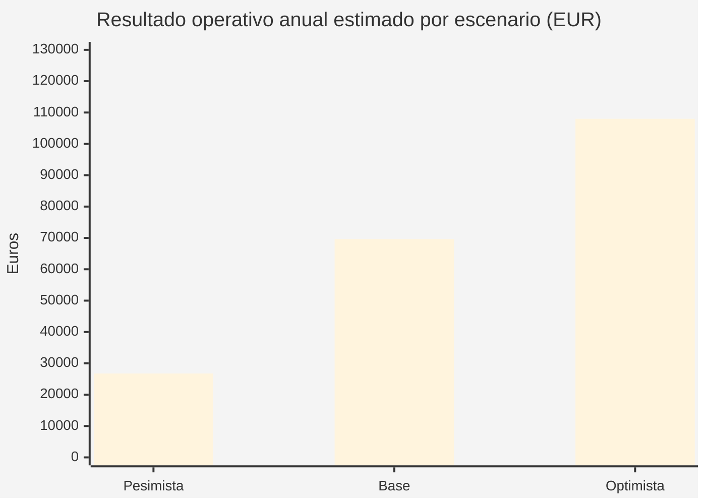
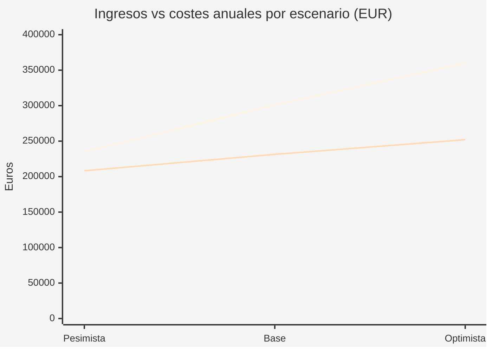
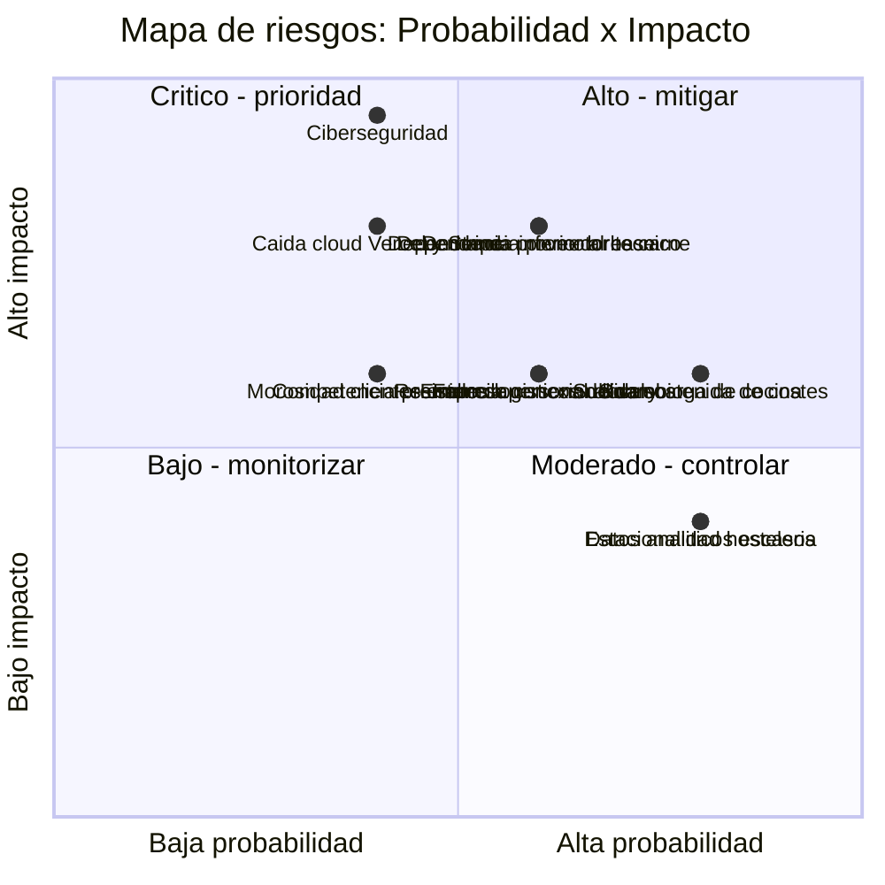

# PLAN DE EMPRESA

# El Buey Madurado

**Restaurante · Hamburguesería gourmet**  
**Plan de empresa y caso real de transformación digital**

---

| | |
|---|---|
| **Autor / Promotor digital** | Michael Llorens Barbera |
| **Módulo** | Empresa e Iniciativa Emprendedora |
| **Ciclo** | 2º DAW SEMI (semipresencial) — Desarrollo de Aplicaciones Web |
| **Centro** | IES L'Estació (Ontinyent) |
| **Tutor** | Juan Torres Mancheño |
| **Curso** | 2025 / 2026 |
| **Empresa cliente** | Restaurante · Hamburguesería El Buey Madurado |
| **Dirección** | Calle Reina, 41 — Xàtiva (Valencia) |
| **Teléfono / WhatsApp** | +34 670 77 57 86 |
| **Email** | elbueymaduradoxativa@gmail.com |
| **Redes sociales** | Instagram: @restaurante_el_buey_madurado · TikTok: @el.buey.madurado |
| **Web** | https://www.restauranteelbueymadurado.com |
| **Google Maps** | Perfil de Google Business activo |
| **Tipo de proyecto** | Transformación digital + plataforma web full-stack (web pública en producción; panel interno y pedidos online en fase de pruebas controladas) |

---

## Índice

1. [Resumen ejecutivo](#1-resumen-ejecutivo)
2. [Idea de negocio y perfil del promotor](#2-idea-de-negocio-y-perfil-del-promotor)
3. [Identidad de marca](#3-identidad-de-marca)
4. [Análisis del entorno, mercado y competencia](#4-análisis-del-entorno-mercado-y-competencia)
5. [DAFO y estrategia empresarial](#5-dafo-y-estrategia-empresarial)
6. [Propuesta de valor y posicionamiento](#6-propuesta-de-valor-y-posicionamiento)
7. [Plan de marketing y ventas](#7-plan-de-marketing-y-ventas)
8. [Plan operativo y transformación digital](#8-plan-operativo-y-transformación-digital)
9. [Validación, métricas e impacto real](#9-validación-métricas-e-impacto-real)
10. [Plan económico-financiero](#10-plan-económico-financiero)
11. [Riesgos y planes de contingencia](#11-riesgos-y-planes-de-contingencia)
12. [Conclusiones y visión de futuro](#12-conclusiones-y-visión-de-futuro)
13. [Bibliografía y fuentes consultadas](#13-bibliografía-y-fuentes-consultadas)
14. [Anexo: cobertura de rúbrica](#14-anexo-cobertura-de-rúbrica)

---

# 1. Resumen Ejecutivo

**El Buey Madurado** es un restaurante y hamburguesería gourmet en **Calle Reina, 41, Xàtiva (Valencia)**. Su propuesta se sostiene sobre un producto con identidad clara: carnes premium maduradas, hamburguesas gourmet hechas con la misma carne que sale al plato en sala y una marca local, cercana y cuidada.

El proyecto que recoge este plan no se limita a una página web. Es una **plataforma full-stack propia** que digitaliza los procesos clave del negocio: carta, pedidos online, pagos, reservas, seguimiento, gestión interna de mesas, cocina, cobros, usuarios y reportes. La **web pública ya está desplegada en dominio propio** y en uso real por el restaurante; el **panel interno y los pedidos online están en fase de pruebas controladas** previa al lanzamiento al cliente final.

La oportunidad empresarial se apoya en tres palancas que se refuerzan entre sí. Primero, un **producto especializado** (carne madurada) que diferencia al restaurante de la oferta generalista de la zona. Segundo, una **marca premium pero local**, que combina calidad gastronómica con una comunicación directa y reconocible, sin caer en un tono distante. Y tercero, un **canal digital propio** que reduce la dependencia de marketplaces, mejora la experiencia del cliente y genera datos sobre los que decidir.

Como la web pública ya está en uso real y el resto de módulos avanzan en pruebas controladas, este plan se presenta como un **caso real de transformación digital en curso de una PYME hostelera**, no como un ejercicio académico simulado. La viabilidad se apoya en una inversión tecnológica contenida, un ticket medio alineado con el posicionamiento premium, ahorro potencial frente a comisiones de marketplaces y mejoras operativas medibles.

### Cifras clave del plan

| Indicador | Valor en escenario base |
|---|---:|
| Inversión inicial valorada | 11.470 € |
| Ingresos mensuales | 25.080 € |
| Costes fijos mensuales | 10.500 € |
| Punto de equilibrio mensual | 16.154 € |
| Ahorro anual por evitar comisiones de marketplace | 5.640 € |
| Resultado operativo anual antes de impuestos | 69.624 € |
| Payback estimado de la plataforma | ≈ 10 meses |
| ROI anual del canal digital | ≈ 121 % |

Estas cifras corresponden al escenario base. El §10 desarrolla el detalle e incluye un **análisis de sensibilidad** con escenarios pesimista (resultado operativo 26.750 €/año) y optimista (108.000 €/año).

---

# 2. Idea de Negocio y Perfil del Promotor

## 2.1. Descripción de la idea de negocio

El Buey Madurado opera con una doble línea de producto:

1. **Carnes premium maduradas:** cortes seleccionados de vaca rubia gallega, buey gallego y wagyu japonés, con maduraciones que pueden alcanzar los 500 días.
2. **Hamburguesas gourmet:** producto más accesible, con rotación superior y capacidad para captar público joven, digital y recurrente.

Esta doble identidad permite atender a públicos distintos sin romper la coherencia de la marca. El restaurante mantiene una imagen premium, pero evita convertirse en una propuesta distante: la carne madurada aporta especialización; la hamburguesa gourmet aporta frecuencia, cercanía y potencial digital.

## 2.2. Datos operativos del establecimiento

| | |
|---|---|
| **Dirección** | Calle Reina, 41 — Xàtiva (Valencia) |
| **Categoría** | Restaurante · Hamburguesería gourmet |
| **Teléfono / WhatsApp** | +34 670 77 57 86 |
| **Email** | elbueymaduradoxativa@gmail.com |
| **Web en producción** | https://www.restauranteelbueymadurado.com |
| **Estado del proyecto digital** | Web pública desplegada en dominio propio y en uso. Panel interno y pedidos online en pruebas controladas previas al lanzamiento. |

### Horario de apertura

| Día | Mediodía | Noche |
|---|---|---|
| Lunes | — | 20:00 - 00:00 |
| Martes | — | 20:00 - 00:00 |
| Miércoles | Cerrado | Cerrado |
| Jueves | — | 20:00 - 00:00 |
| Viernes | 13:00 - 16:30 | 20:00 - 00:00 |
| Sábado | 13:00 - 16:30 | 20:15 - 00:30 |
| Domingo | 13:00 - 16:30 | 20:15 - 00:30 |

**Lectura estratégica del horario:**

- De lunes a jueves se prioriza la cena, donde encajan mejor parejas, grupos reducidos y cliente local.
- De viernes a domingo se amplía la capacidad con mediodías, reforzando turismo, familias y planes gastronómicos.
- El miércoles de cierre puede utilizarse para mantenimiento, control de stock, formación interna y revisión de datos.

## 2.3. Problema que resuelve

| Problema habitual en hostelería local | Solución implementada |
|---|---|
| Carta dispersa en redes, PDF o fotos desactualizadas | Carta digital navegable, con productos, precios, alérgenos y personalización. |
| Pedidos telefónicos con riesgo de errores | Pedido online con carrito, variantes, notas, método de entrega y confirmación. |
| Dependencia de plataformas con comisiones elevadas | Canal propio para recoger y domicilio, con pago online o físico. |
| Falta de datos para decidir | Reportes internos sobre ventas, productos, ticket medio y evolución. |
| Cocina y sala coordinadas de forma manual | Panel interno con tickets de cocina, estados y roles diferenciados. |

## 2.4. Perfil profesional del promotor

**Michael Llorens Barbera**  
*Estudiante de 2º DAW SEMI · Desarrollador full-stack en formación*

### Trayectoria formativa

Mi camino a la programación no ha sido lineal, pero sí coherente. Después de la **ESO** accedí a la Formación Profesional por la **vía de la prueba de acceso a ciclos formativos de grado superior**, sin pasar por bachillerato. Mi primer ciclo fue el **Grado Superior de Desarrollo de Aplicaciones Multiplataforma (DAM)**, que finalicé el curso pasado (2024/2025), donde me especialicé en aplicaciones móviles, programación orientada a objetos y bases de datos relacionales.

Este curso (2025/2026) estoy cursando un **segundo Grado Superior**, el de **Desarrollo de Aplicaciones Web (DAW)** en modalidad **SEMI (semipresencial)** en el **IES L'Estació de Ontinyent**. La elección de DAW tras DAM fue deliberada: quería completar mi perfil con la parte web full-stack (frontend moderno con React/Next.js, backend con Node, despliegue serverless) que el primer ciclo solo tocaba parcialmente. Lo menciono porque define cómo encaro el trabajo: llegué a la FP buscando una salida profesional concreta, y desde el principio intento que lo que aprendo aterrice en proyectos reales, no en ejercicios desconectados del mundo.

### Origen del proyecto

El Buey Madurado no es un cliente que apareció en una hoja de prácticas. Los **propietarios son amigos míos de toda la vida**, gente del entorno de Xàtiva con la que llevo años. Vi cómo arrancaban el restaurante y de primera mano cómo se les iba el tiempo en cosas que la tecnología podía resolver: pedidos por teléfono que se confundían, cartas en PDF que no se actualizaban a tiempo, comisiones de marketplaces que se llevaban un trozo del margen. La conversación de "podría hacerte una plataforma" terminó en este proyecto, que ya está corriendo bajo dominio propio.

Esa relación previa, además de hacer el trabajo más fácil, me ha permitido tener feedback honesto y rápido. Cuando algo no encaja con la operativa real, me lo dicen sin filtros, y eso ha ahorrado muchas decisiones equivocadas.

### Enfoque del trabajo

Mi punto de partida no fue construir "una web bonita". Empecé tratando de entender cómo funciona un restaurante por dentro: cómo entra un pedido, cómo se pasa a cocina, dónde se pierden minutos, dónde se cobran comisiones que no deberían pagarse y qué decisiones se toman a ojo cuando podrían tomarse con datos. A partir de ahí diseñé una plataforma que cubre todo ese recorrido.

Estoy en formación reglada, pero he llevado este proyecto desde la idea inicial hasta un entorno desplegado en dominio propio. No es un prototipo de aula: hay base de datos en la nube, pagos integrados con Stripe, gestión interna por roles y suficientes tests automatizados como para tener cierta confianza al desplegar. La web pública lleva tiempo en uso real; el panel interno y los pedidos siguen en pruebas con el equipo antes de abrirlos al cliente final.

### Competencias técnicas aplicadas

| Área | Competencias demostradas |
|---|---|
| **Frontend** | React 19, Next.js 16 App Router, TypeScript, Tailwind CSS, GSAP, diseño responsive. |
| **Backend** | Route Handlers, APIs REST, validación de datos, lógica de negocio y control de errores. |
| **Base de datos** | MongoDB Atlas, Mongoose, modelado de entidades, agregaciones para reportes. |
| **Autenticación y seguridad** | JWT con `jose`, cookies httpOnly, bcrypt, rate limiting, sanitización y control de roles. |
| **Pagos e integraciones** | Stripe, Cloudinary, Vercel Analytics, CoverManager, Google Business. |
| **Calidad y despliegue** | Vitest, Playwright, ESLint, TypeScript estricto, Docker, GitHub Actions y Vercel. |

### Competencias transversales

| Ámbito | Competencias |
|---|---|
| **Idiomas** | Español (nativo), valenciano (nativo), inglés técnico aplicado a documentación y stack. |
| **Trabajo en equipo** | Comunicación directa con el equipo del restaurante, recogida de feedback operativo e iteración sobre necesidades reales. |
| **Autoaprendizaje** | Adopción autónoma de tecnologías recientes (Next.js 16, React 19, GSAP, Stripe) y aplicación a contexto real. |
| **Orientación a producto** | Decisiones técnicas guiadas por valor de negocio: prioriza usabilidad, fiabilidad y mantenibilidad frente a sobreingeniería. |
| **Gestión de proyecto** | Planificación por fases, documentación técnica, control de versiones, CI/CD y despliegue en producción. |

### Visión empresarial y objetivos profesionales

No me planteo este perfil como el de alguien que "hace webs". Lo entiendo como el de alguien que aplica tecnología a problemas reales de PYMES: errores que se acumulan, pedidos que se pierden por teléfono, comisiones que devoran margen, decisiones que se toman a ojo cuando ya hay herramientas para tomarlas con datos.

Mis objetivos profesionales con este proyecto son cuatro y, sinceramente, están conectados entre sí:

1. **Demostrar capacidad técnica real**, llevando una aplicación full-stack desde la idea hasta producción con criterios de calidad, seguridad y mantenibilidad. No basta con que "funcione en local".
2. **Empezar a especializarme en digitalización de PYMES**, sobre todo en hostelería y comercio de proximidad, que son sectores con mucho margen de mejora digital y donde los SaaS genéricos a menudo no encajan.
3. **Construir un porfolio sólido a partir de proyectos reales** con tracción operativa, no a partir de demos de aula.
4. **Aportar valor medible al negocio cliente**: menos comisiones a intermediarios, una experiencia de cliente más fluida y datos propios sobre los que decidir.

A medio plazo, mi intención es seguir esta línea: replicar el modelo en otros restaurantes o comercios locales que necesiten una plataforma a medida sin asumir el coste de grandes sistemas corporativos.

### Contacto profesional

- **GitHub:** [@Michael-Llorens](https://github.com/Michael-Llorens) — historial de commits, CI/CD y documentación técnica verificables.
- **Email corporativo del cliente:** elbueymaduradoxativa@gmail.com

### Currículum resumido del promotor

A modo de síntesis profesional, esta es la ficha curricular del autor del proyecto:

| Apartado | Datos |
|---|---|
| **Nombre completo** | Michael Llorens Barbera |
| **Rol en el proyecto** | Promotor, desarrollador full-stack, gestor del canal digital y del perfil de Google Business del restaurante |
| **Formación previa** | Grado Superior de Desarrollo de Aplicaciones Multiplataforma (DAM) — finalizado en 2024/2025 |
| **Formación actual** | 2.º curso de Grado Superior de Desarrollo de Aplicaciones Web (DAW SEMI · semipresencial) — IES L'Estació, Ontinyent |
| **Vía de acceso a FP Superior** | Prueba de acceso a ciclos formativos de grado superior (tras la ESO) |
| **Vía de acceso** | Prueba de acceso a ciclos formativos de grado superior, sin paso previo por bachillerato |
| **Idiomas** | Español (nativo), valenciano (nativo), inglés técnico aplicado a documentación, stack y comunicación profesional |
| **Stack técnico dominado** | Next.js 16, React 19, TypeScript, Tailwind CSS, GSAP, Node.js, MongoDB, Mongoose, Stripe, Cloudinary, Vercel, Docker, GitHub Actions |
| **Áreas de especialización** | Aplicaciones full-stack con stack JavaScript moderno, seguridad web (OWASP), integración de pagos online, despliegue serverless y CI/CD |
| **Soft skills clave** | Autoaprendizaje continuo, trabajo con cliente real, comunicación con equipos no técnicos, gestión de proyecto por fases |
| **Experiencia destacada** | Plataforma full-stack en producción para El Buey Madurado (web pública en uso real + panel interno y pedidos online en pruebas controladas) |
| **Repositorio y porfolio** | [github.com/Michael-Llorens](https://github.com/Michael-Llorens) — código abierto, CI/CD, documentación técnica |
| **Objetivo profesional** | Especializarme en digitalización de PYMES de hostelería y comercio local mediante plataformas a medida |

---

# 3. Identidad de Marca

## 3.1. Nombre: El Buey Madurado

El nombre comunica de forma directa el producto principal del restaurante:

| Elemento | Lectura de marca |
|---|---|
| **El** | Aporta cercanía, presencia y sensación de lugar concreto. |
| **Buey** | Remite a producto premium, carne de calidad y especialización. |
| **Madurado** | Introduce el proceso técnico que justifica parte del valor gastronómico. |

La marca es recordable, buscable y coherente con la experiencia que ofrece. No utiliza un nombre abstracto: permite entender la propuesta desde el primer contacto.

## 3.2. Personalidad de marca

El Buey Madurado se posiciona como una marca **premium pero local**, con una comunicación cuidada sin caer en un tono frío o excesivamente elitista.

| Rasgo | Cómo se expresa |
|---|---|
| **Premium** | Producto, maduración, fotografía, paleta visual oscura y dorada. |
| **Local** | Xàtiva, atención directa, WhatsApp, tono cercano, presencia en redes. |
| **Experiencial** | Reserva, carta, seguimiento y presentación del producto como parte del valor. |
| **Directa** | Mensajes claros, sin tecnicismos innecesarios para el cliente final. |

## 3.3. Valores corporativos

Los valores no se enuncian aquí como discurso, sino como **principios verificables** en la operativa diaria del negocio y del proyecto digital. Cada valor lleva asociada al menos una decisión concreta tomada en el restaurante o en la plataforma.

| Valor | Definición operativa | Cómo se traduce en el día a día |
|---|---|---|
| **Calidad sin atajos** | Selección de materia prima, maduración y preparación sin recortar tiempos. | Carne de Cárnicas LYO con maduraciones de hasta 500 días; control de escandallos; sin ingredientes ultraprocesados. |
| **Cercanía local** | Relación directa con el cliente y con la comunidad de Xàtiva. | Atención por WhatsApp Business en horarios humanos, tono cercano en redes ("Cuñao"), apoyo a festividades locales. |
| **Transparencia** | Información clara y completa sobre lo que el cliente come y paga. | Alérgenos UE visibles por plato, precios sin recargos ocultos, seguimiento del pedido en tiempo real. |
| **Innovación útil** | Adoptar tecnología solo cuando aporta valor medible al negocio. | Plataforma propia para evitar comisiones de marketplaces; reportes para decidir con datos, no por intuición. |
| **Respeto al producto y a quien lo trabaja** | Reconocimiento al origen, al proveedor y al equipo. | Trazabilidad visible en la carta, relación a largo plazo con proveedores locales, formación interna del equipo en el dashboard. |
| **Honestidad profesional** | No prometer lo que no se puede sostener. | Eslogan delivery formulado como "experiencia gastronómica en casa", sin pretender ser idéntica a la de sala. |

Estos valores enmarcan tanto la operación del restaurante como las decisiones del proyecto digital. La coherencia entre lo que se dice y lo que se hace es lo que diferencia un valor corporativo real de una declaración de intenciones.

## 3.4. Logotipo

El logotipo del restaurante se compone de una tipografía gruesa en color ámbar/dorado sobre fondo marrón muy oscuro, acompañada de un símbolo gráfico asociado al corte y la maduración de la carne. El conjunto transmite carácter premium, calidez y especialización gastronómica sin caer en lo solemne ni en lo agresivo.

**Archivos oficiales del logotipo en el proyecto:**

| Recurso | Ubicación en el repositorio | Uso |
|---|---|---|
| Logo en alta resolución (PWA, redes, cartelería) | `public/icons/icon-512.png` | Comunicación principal, redes sociales |
| Logo PWA estándar | `public/icons/icon-192.png` | Instalación de la web como aplicación |
| Logo maskable (PWA adaptable) | `public/icons/icon-maskable-512.png` | Iconos adaptables Android |
| Favicon | `public/logo-fondo-blanco.ico` | Pestaña del navegador |

> **Nota:** en la versión final en PDF de este Plan de Empresa se incluirá una reproducción del logotipo en la portada y al inicio de la sección de identidad de marca.

## 3.5. Sistema visual

La identidad visual se apoya en una estética oscura, con tonos ámbar/dorados que recuerdan a brasa, grasa infiltrada, madera y maduración.

| Elemento | Uso recomendado |
|---|---|
| **Color principal** | Ámbar/dorado para CTAs, acentos y marca. |
| **Fondo** | Marrón muy oscuro o negro cálido para transmitir profundidad. |
| **Acentos** | Rojo para puntos de carne y verde para confirmaciones o estados correctos. |
| **Fotografía** | Producto real, cortes, cocina, local, equipo y emplatado. |

## 3.6. Arquitectura de mensajes

| Mensaje | Uso | Versión refinada |
|---|---|---|
| **"No hablamos de comida rápida; hablamos de alta cocina."** | Hero o claim principal | Mantiene fuerza y diferencia hamburguesa gourmet de fast food. |
| **"No es solo delivery: es una experiencia gastronómica en casa."** | Canal de pedidos | Más honesto que prometer una experiencia idéntica a la de sala. |
| **"La carne no se explica, se respeta."** | Manifiesto de marca | Adecuado para reforzar filosofía y producto. |
| **"Cuñao, prueba esto."** | Redes y producto rotativo | Útil en piezas concretas, no como tono general del plan empresarial. |

La estrategia recomendada es conservar la personalidad, pero reservar el tono más informal para redes sociales, campañas o productos como "Los Cuñaos". En el plan de empresa conviene priorizar una voz profesional, con frases de marca puntuales y bien contextualizadas.

---

# 4. Análisis del Entorno, Mercado y Competencia

## 4.1. Análisis PESTEL

| Dimensión | Situación | Impacto en el proyecto |
|---|---|---|
| **Político-legal** | Normativa de hostelería, alérgenos (Reglamento UE 1169/2011), RGPD, PSD2 y licencias de actividad. **Políticas activas de creación de empresas:** tarifa plana de autónomos (80 €/mes el primer año en muchos casos), bonificaciones a la contratación juvenil, ayudas autonómicas a la digitalización (Kit Digital con bonos de hasta 12.000 € para PYMES, Línea ICO Empresas). | La plataforma incorpora alérgenos, pagos mediante Stripe y estructura preparada para privacidad y seguridad. El proyecto encaja directamente con los criterios elegibles del Kit Digital. |
| **Económica** | **Contexto internacional:** la Eurozona crece a ritmo moderado (≈ 0,8-1,5 % anual según previsiones BCE), con presiones inflacionarias derivadas del coste energético y tensiones geopolíticas que encarecen materias primas globales. La política monetaria del **BCE** mantiene tipos de interés en torno al **2,5-3 %** tras los recortes de 2024-2025. EE. UU. y China continúan dictando el precio de muchas materias primas y la fortaleza del euro afecta directamente al coste de importaciones (como el wagyu japonés). **Contexto nacional:** la **inflación** en España se ha movido entre el 2 % y el 4 % anual en 2024-2025, presionando márgenes. La **carne premium** ha subido 15-25 % en 3 años. **Tasa de paro nacional** próxima al 11 % (INE 2024), con dificultad creciente para contratar perfil cualificado en hostelería. **Renta media por hogar en Xàtiva** ≈ 22.000 €, con disposición razonable al consumo gastronómico premium. | Es necesario controlar precios, escandallos y rotación de productos. Los reportes operativos ayudan a tomar decisiones sin esperar al cierre contable. El bajo coste fijo digital amortigua la presión de costes variables. La exposición a materias primas importadas (wagyu) obliga a tener proveedor alternativo nacional homologado. |
| **Sociocultural** | Crece el interés por experiencias gastronómicas, producto diferenciado, trazabilidad y contenido visual en redes. Cambio generacional: millennials y Gen Z priorizan experiencias sobre posesiones. | El restaurante puede apoyarse en fotografía real, reseñas y narrativas de producto para conectar con ese consumidor. |
| **Tecnológica** | El cliente espera reservas, pagos y consulta de carta desde el móvil. Penetración del smartphone > 95 % en menores de 65 años. Más del 60 % de los pagos en hostelería ya son contactless. Auge de la IA generativa aplicada al comercio local. | La web propia mejora la accesibilidad y reduce fricción en la compra; abre opciones futuras (chatbot, recomendaciones automáticas). |
| **Ecológica** | Aumenta la sensibilidad hacia trazabilidad, desperdicio alimentario, packaging y bienestar animal. | La carta digital y los reportes de stock pueden contribuir a consumo más responsable y a evitar mermas. |
| **Legal digital** | Protección de datos, seguridad de pagos y gestión de credenciales. PCI-DSS gestionado por Stripe, SCA por PSD2. | Uso de Stripe Elements (datos de tarjeta nunca llegan al servidor), cookies httpOnly, roles, validación de entrada y separación de datos sensibles. |

## 4.2. Mercado objetivo

El restaurante compite en el mercado de **restauración premium especializada** en Xàtiva y comarca, con extensión digital para pedidos a recoger y domicilio en radio cercano. El producto no busca competir por precio con hamburgueserías estándar, sino por valor: calidad de carne, marca, servicio y experiencia.

### Segmentos principales

| Segmento | Perfil | Necesidad | Ticket estimado |
|---|---|---|---|
| **Foodie local** | 30-55 años, residente en Xàtiva o comarca, valora producto y reseñas. | Experiencia gastronómica diferenciada. | 40-60 €/persona |
| **Joven urbano** | 20-32 años, móvil primero, decide por redes y fotos. | Hamburguesa premium fácil de pedir y compartir. | 18-28 €/persona |
| **Profesional / empresa** | 35-55 años, comidas de trabajo o reuniones. | Reserva sencilla, calidad constante y factura. | 35-55 €/persona |
| **Cliente a domicilio** | 25-50 años, busca calidad en casa. | Pedido claro, pago cómodo y entrega fiable. | 25-40 €/pedido |

### Caracterización psicográfica de cada segmento

Más allá de la demografía, los segmentos se caracterizan por **intereses, estilo de vida, valores y comportamientos de consumo**. Esta lectura psicográfica permite afinar la comunicación y la propuesta para cada perfil.

| Segmento | Intereses | Estilo de vida | Valores que activan la compra | Comportamiento de consumo |
|---|---|---|---|---|
| **Foodie local** | Gastronomía, vinos, viajes culinarios, cocina de autor. | Renta media-alta, ocio cuidado, salidas planificadas. | Calidad, autenticidad, producto local, trazabilidad. | Reserva con antelación, ticket alto, frecuencia mensual, comparte experiencia en redes. |
| **Joven urbano** | Cultura digital, foodie casual, redes sociales, planes de grupo. | Vida urbana activa, decisión rápida basada en reseñas e imagen. | Calidad/precio justa, estética, conveniencia, "compartibilidad" en Instagram. | Pide online desde móvil, suele ir en grupo, frecuencia 2-4 veces/mes, ticket medio. |
| **Profesional / empresa** | Networking, eficiencia, gastronomía como herramienta de relaciones. | Comidas de trabajo, agenda apretada, valora ahorro de tiempo. | Discreción, calidad consistente, atención profesional, factura inmediata. | Reserva sencilla por web, pide siempre productos contrastados, asiduo en franja mediodía laborable. |
| **Cliente a domicilio** | Cocina premium en casa, cine/series, planes con pareja o familia. | Vida más doméstica, no quiere desplazarse pero sí mantener calidad. | Comodidad, calidad real (no comida rápida), precio transparente, control del pago. | Pide 1-2 veces/mes, ticket medio-alto, evita marketplaces por las comisiones que percibe el cliente final. |

Justificación de la idoneidad de los segmentos: estos cuatro perfiles cubren los dos pilares del producto (carne premium en sala + hamburguesa gourmet) y los tres canales (sala, recoger, domicilio), sin diluir la marca ni renunciar al posicionamiento premium.

### Mapa del proceso de compra del cliente (Customer Journey)

Para diseñar la propuesta de valor con criterio, se ha analizado el **recorrido completo del cliente** desde que conoce el restaurante hasta que repite y recomienda. Cada fase identifica el touchpoint principal, la emoción dominante del cliente y la respuesta que da el restaurante o la plataforma.

| Fase | Touchpoint principal | Lo que vive el cliente | Lo que aporta El Buey Madurado |
|---|---|---|---|
| **1. Descubrimiento** | Google Maps, redes sociales, recomendación de un amigo. | "He oído hablar de este sitio, voy a investigar." | Perfil de Google Business gestionado, reseñas reales (5,0 ★), contenido visual propio en Instagram y TikTok. |
| **2. Investigación** | Web propia (`restauranteelbueymadurado.com`). | "Quiero ver la carta, ver el local, leer reseñas, decidir si encaja." | Web rápida, carta digital con filtros, sección "Sobre nosotros" con historia, reseñas Google integradas. |
| **3. Decisión** | Carta, precios, alérgenos, ubicación. | "¿Me cuadra el precio? ¿Tienen lo que busco? ¿Hay alérgenos visibles?" | Precios claros, alérgenos UE en cada plato, fotos reales del producto, sin sorpresas. |
| **4. Reserva** | Widget CoverManager 24/7 o WhatsApp Business. | "Quiero reservar sin tener que llamar." | Reserva online 24/7 con confirmación inmediata, alternativa por WhatsApp para casos especiales. |
| **5. Anticipación** | Recordatorio + redes sociales del restaurante. | "Espero con ganas la cena, comento con quien viene conmigo." | Recordatorio automático antes de la reserva, contenido aspiracional en redes. |
| **6. Experiencia en sala** | Local, equipo, plato, atención. | "Quiero que la realidad esté a la altura de la expectativa." | Producto premium, atención cercana, dashboard interno que ayuda al equipo a no equivocarse. |
| **7. Pedido online (alternativa)** | Web → carrito → checkout. | "No puedo ir, pero quiero la misma calidad en casa." | Pedido directo sin comisión, personalización por plato, pago Stripe, seguimiento en vivo. |
| **8. Pago** | TPV en sala o Stripe online. | "Que sea rápido, claro y sin sorpresas en la cuenta." | Cobro con cálculo automático de cambio en sala; pago Stripe online sin recargo. |
| **9. Postventa** | Reseña en Google, foto en Instagram, comentario con amigos. | "Quiero contar lo que me ha pasado, bueno o malo." | Gestión activa de reseñas, agradecimiento personalizado, respuesta a reseñas negativas. |
| **10. Fidelización** | Repetición, recomendación, "Madurado Tour", eventos. | "Si la primera vez fue buena, vuelvo y traigo a alguien." | Promociones tácticas (Madurado Tour, primer pedido online con descuento), datos propios para acciones futuras. |

**Lectura del journey:** la plataforma cubre cada fase con una herramienta o proceso concreto. Donde la competencia falla habitualmente (fases 2, 3, 4, 7 y 8 — el bloque digital) es precisamente donde la propuesta de El Buey Madurado se diferencia.

## 4.3. Análisis de competencia

La competencia no debe plantearse como inexistente. En Xàtiva y alrededores existen alternativas de restauración, bares, restaurantes tradicionales, hamburgueserías, delivery y propuestas de cocina mediterránea. La diferencia de El Buey Madurado está en la combinación de especialización cárnica, marca premium local y plataforma digital propia.

| Tipo de competidor | Fortalezas | Debilidades habituales | Posición de El Buey Madurado |
|---|---|---|---|
| **Restaurante tradicional local** | Reputación, clientela fiel, conocimiento de la zona. | Digitalización limitada, carta poco interactiva, menor captura de datos. | Mantiene cercanía local y añade canal digital propio. |
| **Hamburguesería convencional** | Precio, rapidez, frecuencia de consumo. | Menor percepción premium y menor especialización en carne madurada. | Compite por calidad y experiencia, no solo por precio. |
| **Restaurante de hotel o zona turística** | Ubicación, flujo turístico. | Propuesta más generalista y menor personalidad gastronómica. | Se posiciona como destino gastronómico específico. |
| **Marketplaces delivery** | Base de usuarios, visibilidad y logística. | Comisiones, menor control del dato y experiencia menos personalizada. | Canal directo con ahorro de comisiones y control de relación con cliente. |

### Mapa del proceso de compra: comparativa con la competencia

Para identificar dónde aporta valor diferencial la propuesta, se compara cada **touchpoint del proceso de compra** del cliente en los tres tipos de competidor más relevantes frente a la experiencia en El Buey Madurado. La idea es detectar deficiencias, ausencias o servicios superfluos en la competencia que puedan convertirse en argumento de la propuesta de valor.

| Fase del proceso | Restaurante tradicional local | Hamburguesería convencional | Marketplace (Glovo/UberEats) | El Buey Madurado |
|---|---|---|---|---|
| **1. Descubrimiento** | Boca a boca, Google Maps básico | Cartelería, redes esporádicas | Algoritmo de la app, banners | Google Business activo, web SEO, redes y contenido visual propio |
| **2. Consulta de carta** | PDF, foto en redes o llamada | Carta física o foto en redes | Carta dentro de la app del marketplace | Carta digital interactiva con filtros, alérgenos UE y búsqueda |
| **3. Personalización del producto** | Verbal al camarero | Limitada o inexistente | Extras predefinidos por la app | Personalización completa: extras, sin ingredientes, punto de carne, notas para cocina |
| **4. Reserva** | Teléfono en horario de apertura | No suele aplicar | No aplica | Widget CoverManager 24/7 + WhatsApp Business directo |
| **5. Pedido online** | No disponible o por teléfono | No disponible | Pedido dentro de la app (con comisión 25-30 %) | Carrito propio con variantes, sin comisiones intermedias |
| **6. Pago** | En efectivo o tarjeta en local | Efectivo o tarjeta en local | Tarjeta vía marketplace | Stripe (tarjeta, Apple Pay, Google Pay) o pago al recoger |
| **7. Cocina y preparación** | Comanda manual, papel | Comanda manual o TPV simple | Comanda manual con tablet de pantalla | Panel Kanban en vivo con estados, roles y notificación sonora |
| **8. Seguimiento del pedido** | Llamada para preguntar | No aplica | Tracking estándar del marketplace | Página de seguimiento propia en tiempo real con barra animada |
| **9. Cobro en sala** | Caja registradora tradicional | TPV simple | No aplica | Cobro digital con cálculo automático de cambio, mixto o tarjeta |
| **10. Postventa y fidelización** | Reseña ocasional en Google | No estructurada | Datos retenidos por el marketplace | Datos propios para reportes y futuras acciones de fidelización |

**Lectura del mapa:** la mayoría de competidores son fuertes en uno o dos touchpoints (producto, ubicación, base de usuarios), pero rara vez cubren el ciclo completo de compra con experiencia propia. Los marketplaces resuelven el touchpoint digital, pero se quedan con la relación con el cliente y con un 25-30 % de la venta. La propuesta de El Buey Madurado consiste precisamente en **cubrir todos los touchpoints sin intermediarios**, no en ganar a la competencia en uno solo.

**Conclusión competitiva:** el proyecto no anula a la competencia, pero abre un espacio que muchos restaurantes locales todavía no ocupan: el cruce entre gastronomía especializada y plataforma digital propia. La ventaja no está en hacer una de las dos cosas, sino en integrarlas con cierto criterio.

---

# 5. DAFO y Estrategia Empresarial

## 5.1. Fortalezas

| F | Descripción | Estrategia |
|---|---|---|
| **F1** | Producto premium con identidad clara. | Comunicar origen, maduración y preparación con contenido real. |
| **F2** | Plataforma digital propia. | Usarla como argumento de comodidad, independencia y eficiencia. |
| **F3** | Marca local con personalidad. | Mantener tono cercano en redes y profesional en canales formales. |
| **F4** | Sistema interno conectado con sala y cocina. | Formar al equipo y reducir errores operativos. |
| **F5** | Coste tecnológico inicial contenido. | Reinvertir margen en marketing, fotografía y mejora de producto. |

## 5.2. Debilidades

| D | Descripción | Mitigación |
|---|---|---|
| **D1** | Ticket medio alto en carnes premium. | Mantener hamburguesas gourmet como producto de entrada. |
| **D2** | Dependencia de proveedores especializados. | Homologar proveedor secundario y definir stock mínimo. |
| **D3** | Capacidad operativa limitada en picos. | Control de franjas horarias, tiempos estimados y priorización en cocina. |
| **D4** | Marca aún en fase de consolidación fuera de Xàtiva. | SEO local, reseñas, colaboraciones y campañas segmentadas. |
| **D5** | Necesidad de mantenimiento técnico. | Documentación, backups, monitorización y traspaso básico al equipo. |

## 5.3. Oportunidades

| O | Descripción | Acción |
|---|---|---|
| **O1** | Crecimiento del pedido online directo. | Incentivar recogida y domicilio desde web propia. |
| **O2** | Digitalización de PYMES y ayudas públicas. | Estudiar Kit Digital u otras ayudas para fases futuras. |
| **O3** | Turismo gastronómico en Xàtiva. | Trabajar Google Business, Tripadvisor y acuerdos con alojamientos. |
| **O4** | Eventos privados y comidas de empresa. | Crear página específica con menús cerrados y reserva previa. |
| **O5** | Contenido gastronómico en redes. | Plan mensual de contenido con producto real, cocina y equipo. |

## 5.4. Amenazas

| A | Descripción | Respuesta |
|---|---|---|
| **A1** | Subida de costes de carne y energía. | Escandallos, revisión trimestral de precios y control de merma. |
| **A2** | Entrada de cadenas o conceptos similares. | Reforzar autenticidad local, reseñas y experiencia personalizada. |
| **A3** | Caída de consumo por contexto económico. | Mantener productos accesibles y promociones controladas. |
| **A4** | Fallos tecnológicos o dependencia cloud. | Plan de continuidad con carta estática, backup y operación manual. |
| **A5** | Saturación publicitaria en redes. | Priorizar contenido real, reseñas y campañas geolocalizadas. |

## 5.5. Estrategias cruzadas

| Estrategia | Aplicación |
|---|---|
| **F2 + O1** | Convertir el canal propio en vía preferente de pedidos y recogida. |
| **F1 + O3** | Posicionar el restaurante como experiencia gastronómica específica para visitantes de Xàtiva. |
| **D1 + A3** | Proteger demanda con hamburguesas premium y menús de entrada sin devaluar la marca. |
| **D5 + A4** | Documentar procedimientos técnicos y operativos para reducir dependencia de una sola persona. |

## 5.6. Sostenibilidad: grupos de interés, aspectos ASG y alineación con los ODS

La sostenibilidad del proyecto se aborda desde dos marcos complementarios. El primero, el marco **ASG** (Ambiental, Social y de Gobernanza), permite identificar aspectos materiales del negocio y trazar acciones concretas para gestionarlos. El segundo, los **Objetivos de Desarrollo Sostenible** de la Agenda 2030, sitúa esas acciones en un contexto global compartido.

### Grupos de interés (stakeholders)

Antes de medir aspectos materiales conviene identificar a quién afectan. Los principales grupos de interés del proyecto son:

| Stakeholder | Expectativa principal | Cómo responde el proyecto |
|---|---|---|
| **Clientes finales** | Producto premium, experiencia de compra ágil, transparencia de precios y alérgenos. | Carta digital, personalización, alérgenos UE, pago flexible, seguimiento en tiempo real. |
| **Propietarios del restaurante** | Rentabilidad, control del canal directo, datos para decidir. | Reducción de comisiones a marketplaces, dashboard interno, módulo de reportes. |
| **Equipo de sala y cocina** | Herramientas que faciliten su trabajo, no que lo entorpezcan. | Panel Kanban de cocina, gestión de mesas, cobros con cálculo automático, formación interna. |
| **Proveedores locales (Cárnicas LYO, bodegas)** | Relación estable y volumen previsible. | Relación directa, sin intermediación de cadenas globales; trazabilidad visible en la carta. |
| **Administraciones públicas** | Cumplimiento normativo (alérgenos, RGPD, PSD2, fiscalidad). | Validación automática de alérgenos, RGPD aplicado, pagos con Stripe (PCI-DSS automático). |
| **Comunidad de Xàtiva** | Empleo local y dinamización del comercio de proximidad. | Empleo local, presencia activa en Google Business, vínculos con festividades locales. |

### Aspectos ASG materiales y acciones de gestión

| Pilar ASG | Aspecto material para el negocio | Acción concreta del proyecto | Cómo se mide |
|---|---|---|---|
| **Ambiental (A)** | Desperdicio alimentario y consumo de packaging | Reportes de stock y previsión de demanda para reducir merma; carta digital que elimina cartas impresas; plan de transición a packaging biodegradable en domicilio | Kg de merma mensual / coste de packaging por pedido |
| **Ambiental (A)** | Huella energética del negocio digital | Uso de proveedores cloud con eficiencia energética (Vercel, MongoDB Atlas) escalables según uso real, evitando sobredimensionamiento | Coste mensual cloud / consumo equivalente |
| **Social (S)** | Salud y seguridad del cliente | Información de alérgenos UE en cada plato según Reglamento 1169/2011; trazabilidad de origen de la carne | Incidencias de alergias / reseñas relacionadas |
| **Social (S)** | Empleo local y formación digital | Contratación local en Xàtiva; formación interna del equipo en el uso del dashboard interno | Personas empleadas / horas de formación al año |
| **Social (S)** | Relación con proveedores locales | Acuerdos directos con proveedor especializado de carne (Cárnicas LYO) y bodegas locales | % de proveedores locales sobre el total |
| **Gobernanza (G)** | Protección de datos y seguridad | RGPD aplicado en formularios y pedidos, JWT en cookie httpOnly, cifrado de credenciales, PCI-DSS gestionado por Stripe | Incidentes de seguridad / auditoría OWASP |
| **Gobernanza (G)** | Transparencia con el cliente | Carta, precios y alérgenos visibles 24/7; sin recargos ocultos; seguimiento del pedido en tiempo real | Reclamaciones por sorpresas en factura / valoración de transparencia |
| **Gobernanza (G)** | Trazabilidad operativa interna | Reportes automatizados de ventas, productos y tickets accesibles solo por rol admin; histórico de cambios en pedidos | % de decisiones tomadas con datos / cobertura de reportes |

### Alineación con los Objetivos de Desarrollo Sostenible (ODS)

| ODS | Alineación concreta del proyecto |
|---|---|
| **ODS 3 — Salud y bienestar** | Información clara y completa de alérgenos por plato según Reglamento UE 1169/2011, lo que protege a clientes alérgicos y reduce errores de comunicación. |
| **ODS 8 — Trabajo decente y crecimiento económico** | Empleo local en Xàtiva y formación digital del personal en el uso del dashboard interno. |
| **ODS 9 — Industria, innovación e infraestructura** | Caso de transformación digital de una PYME hostelera mediante adopción de stack cloud moderno, arquitectura escalable y desarrollo a medida. |
| **ODS 12 — Producción y consumo responsables** | Reportes de ventas y consumo que ayudan a ajustar compras, reducir merma y planificar la carta con base en datos reales. |
| **ODS 17 — Alianzas para lograr los objetivos** | Relación directa con proveedores locales y especializados (carne premium) frente a la lógica de cadenas globales. |

La sostenibilidad no se plantea aquí como discurso reputacional, sino como **subproducto natural de un modelo basado en producto local, datos propios, trazabilidad y digitalización responsable**. El marco ASG facilita además su seguimiento operativo, porque cada aspecto material tiene una métrica asociada que el restaurante puede revisar periódicamente.

---

# 6. Propuesta de Valor y Posicionamiento

## 6.1. Propuesta de valor

> **El Buey Madurado ofrece carne madurada premium y hamburguesas gourmet en Xàtiva, combinando producto de calidad, marca local y una experiencia digital propia que permite reservar, pedir, pagar y seguir pedidos sin depender de intermediarios.**

La propuesta se apoya en tres pilares:

| Pilar | Valor para el cliente | Valor para el negocio |
|---|---|---|
| **Producto** | Carne seleccionada, maduración, hamburguesas gourmet y trazabilidad. | Mayor diferenciación y ticket medio. |
| **Experiencia** | Carta clara, pedido sencillo, pago flexible y seguimiento. | Menos errores, más control y mejor percepción. |
| **Canal propio** | Relación directa con el restaurante. | Ahorro de comisiones, datos propios y fidelización. |

## 6.2. Posicionamiento

El restaurante se sitúa en un espacio de **calidad alta y digitalización alta**, sin competir como cadena ni como fast food.

| Eje | Posición buscada |
|---|---|
| **Precio** | Medio-alto, coherente con producto premium. |
| **Calidad** | Alta, basada en materia prima y preparación. |
| **Digitalización** | Por encima de la media de restaurantes locales comparables, que habitualmente operan con web informativa, PDF de carta o sin canal digital propio. |
| **Tono** | Premium cercano, no elitista. |

## 6.3. Mensajes por audiencia

| Audiencia | Mensaje recomendado |
|---|---|
| **Foodie local** | "Carne madurada premium en Xàtiva, con reserva sencilla y una experiencia cuidada de principio a fin." |
| **Joven urbano** | "Hamburguesas gourmet con producto real, listas para pedir desde el móvil." |
| **Empresa** | "Un espacio local con calidad, reserva ágil y servicio preparado para comidas de trabajo." |
| **Cliente a domicilio** | "Pedido directo desde el restaurante, sin intermediarios y con seguimiento online." |

---

# 7. Plan de Marketing y Ventas

## 7.1. Producto

| Línea | Papel estratégico |
|---|---|
| **Carnes premium** | Producto de prestigio, margen alto y diferenciación. |
| **Hamburguesas gourmet** | Entrada de nuevos clientes, repetición y canal digital. |
| **Entrantes y postres** | Incremento de ticket medio y experiencia completa. |
| **Bebidas y vinos** | Complemento de margen y posicionamiento gastronómico. |

## 7.2. Precio

La estrategia de precios es premium, pero con argumento detrás. No se compite con hamburgueserías de bajo precio ni con delivery masivo: se compite por valor percibido, producto y comodidad.

| Producto / servicio | Rango orientativo |
|---|---:|
| Hamburguesa gourmet | 15 - 18 € |
| Menú individual con bebida | 20 - 28 € |
| Experiencia carne premium | 40 - 60 €/persona |
| Pedido medio a domicilio / recoger | 25 - 40 € |
| Gasto de envío local | 3,50 € |

## 7.3. Plaza / distribución

| Canal | Función | Peso estimado sobre ventas |
|---|---|---:|
| **Sala** | Experiencia completa y producto premium. | 60 % |
| **Recogida en local** | Canal rentable, sin reparto y con pedido anticipado. | 25 % |
| **Domicilio propio** | Crecimiento digital controlado. | 15 % |
| **Eventos privados** | Línea futura para tickets altos y planificación previa. | Complementario |

## 7.4. Promoción

| Acción | Objetivo | Coste estimado |
|---|---|---:|
| **Primer pedido directo** | Incentivar uso de web propia con 10 % de descuento limitado. | Coste variable controlado |
| **Madurado Tour** | Menú degustación mensual para generar contenido y ocupación en día débil. | Según escandallo |
| **Colaboraciones locales** | Foodies y medios comarcales con audiencia real en Valencia interior. | 80 - 120 €/acción |
| **Google Business activo** | Captar demanda con intención de búsqueda. | 0 € + gestión |
| **Instagram Ads geolocalizado** | Alcance local en Xàtiva y comarca. | 100 - 150 €/mes |
| **Google Ads local** | Captar búsquedas tipo "restaurante carne Xàtiva". | 80 - 120 €/mes |

## 7.5. Calendario comercial básico

| Trimestre | Prioridad |
|---|---|
| **T1** | Consolidar web, carta, reservas y primer pedido directo. |
| **T2** | Campañas locales, colaboración con foodies y medición de conversión. |
| **T3** | Temporada turística, Feria de Xàtiva y contenido de producto. |
| **T4** | Cenas de empresa, bonos regalo y menús para grupos. |

---

# 8. Plan Operativo y Transformación Digital

## 8.1. Plataforma desarrollada

La plataforma cubre dos áreas: experiencia pública del cliente y gestión interna del restaurante.

| Área | Funcionalidades |
|---|---|
| **Web pública** | Home, carta, sobre nosotros, contacto, reservas, pedidos, carrito, checkout y seguimiento. |
| **Pedidos** | Recoger, domicilio o comer en local; personalización, notas, método de pago y estado. |
| **Pagos** | Stripe para tarjeta, Apple Pay y Google Pay; alternativa de pago físico. |
| **Dashboard interno** | Gestión de productos, ingredientes, mesas, pedidos, cocina, cobros, usuarios y reportes. |
| **Roles** | Admin, camarero y cocinero, con permisos diferenciados. |

## 8.2. Stack tecnológico

| Capa | Tecnología |
|---|---|
| **Frontend** | Next.js 16, React 19, TypeScript, Tailwind CSS, GSAP. |
| **Backend** | Next.js Route Handlers, servicios propios y validación de datos. |
| **Base de datos** | MongoDB Atlas + Mongoose. |
| **Autenticación** | JWT con `jose`, cookies httpOnly, bcrypt. |
| **Pagos** | Stripe. |
| **Imágenes** | Cloudinary. |
| **Calidad** | Vitest, Playwright, ESLint, TypeScript estricto. |
| **Despliegue** | Vercel, GitHub Actions, Docker para entorno local. |

### Una decisión técnica que merece justificación: MongoDB en lugar de PostgreSQL

Una de las decisiones más discutibles del proyecto, y por la que probablemente me preguntarán, fue elegir **MongoDB** como base de datos en lugar de una relacional clásica como PostgreSQL. La elección no fue por moda ni por comodidad: respondió a la naturaleza de los datos del restaurante.

Una hamburguesa tiene un nombre, un precio y una foto. Pero también tiene **ingredientes que se pueden añadir o quitar**, un **punto de la carne** que el cliente elige, **alérgenos heredados de cada ingrediente**, y **notas libres para cocina**. Si modelara esto en relacional acabaría con cinco o seis tablas, varios joins por cada lectura de carta, y migraciones cada vez que el restaurante quisiera añadir un nuevo tipo de extra. Con un modelo documental, todo eso vive en el mismo documento del producto, y la carta se sirve con una sola consulta.

A cambio asumo dos limitaciones que conviene reconocer:

- **Transacciones multi-documento más complejas.** Mongoose y MongoDB las soportan, pero hay que tratarlas con cuidado (especialmente en pagos y reservas concurrentes).
- **Integridad referencial menos estricta.** No hay claves foráneas como en SQL, así que parte de la consistencia se valida en el código (Mongoose schemas + validaciones en API routes).

En la práctica, para el dominio de este negocio —producto rico en variantes, evolución frecuente de la carta y reportes basados en agregaciones— el balance ha sido favorable. Si en el futuro el cliente necesitara reporting analítico avanzado o consolidar datos con otros negocios, PostgreSQL volvería a entrar en la conversación.

## 8.3. Impacto operativo esperado

| Proceso | Antes | Con plataforma |
|---|---|---|
| Carta | Consulta manual, redes o PDF. | Carta actualizable y accesible 24/7. |
| Pedido | Teléfono, WhatsApp o comanda manual. | Pedido estructurado con variantes y confirmación. |
| Cocina | Comunicación verbal o papel. | Panel de tickets y estados. |
| Cobro | Cálculo manual. | Cobro asistido y registro del pedido. |
| Gestión | Decisiones por intuición. | Reportes de productos, ventas y tickets. |

---

# 9. Validación, Métricas e Impacto Real

## 9.1. Estado actual del proyecto

| Hito | Estado |
|---|---|
| Restaurante físico operativo | Activo en Calle Reina, 41 — Xàtiva. |
| Web pública | Desplegada en Vercel bajo dominio propio (`restauranteelbueymadurado.com`) y en uso real. |
| Carta digital | Implementada, con productos, navegación, filtros y alérgenos. |
| Pedidos online | Implementados con carrito, checkout y seguimiento; **pendientes de activación al público** tras la fase de pruebas. |
| Pagos Stripe | Integración funcional en entorno de prueba, preparada para conmutación a producción. |
| Dashboard interno | Implementado y operativo internamente; **en fase de pruebas con el equipo** previa al uso diario. |
| Perfil de Google Business | Configurado y gestionado activamente por el promotor. |
| Tests automatizados | 71 tests documentados en el proyecto. |

## 9.2. Métricas recomendadas de seguimiento

Estas cifras son **objetivos conservadores de validación inicial** para los primeros 3-6 meses del canal digital. No sustituyen a los datos reales de analítica una vez que el negocio acumule histórico. Cada objetivo se cruza con un **rango de referencia del sector** para que el valor no salga de la nada.

| Métrica | Objetivo inicial | Referencia de sector | Lectura empresarial |
|---|---:|---|---|
| Visitas web mensuales | 800 - 1.500 | Web local de restaurante en ciudad < 50.000 hab.: 500 - 2.000 visitas/mes según presencia en Google Business. | Alcance local razonable con SEO básico y redes. |
| Conversión visita → reserva/pedido | 2 % - 5 % | Restauración local con tráfico cualificado: 2 % - 6 % (rango habitual del sector). | Ni demasiado conservador ni demasiado optimista. |
| Pedidos online mensuales | 35 - 80 | Restaurantes premium con canal propio en ciudad media: 30 - 100 pedidos/mes en primeros meses. | Validación de canal propio sin depender de marketplaces. |
| Reservas digitales mensuales | 25 - 60 | Reservas online en restaurantes con widget: típicamente 20 - 50 % del total de reservas. | Reducción de llamadas y mejor planificación de sala. |
| Ticket medio online | 28 - 35 € | Pedidos premium para recoger / domicilio: 25 - 40 € (sector). | Encaja con hamburguesas premium y pedidos compartidos. |
| Ticket medio sala | 38 - 50 €/persona | Restauración premium con carne: 35 - 60 €/persona. | Encaja con un menú de carne madurada, entrante y bebida. |
| Tiempo de carga objetivo | < 2,5 s en móvil | Web Vitals "Good": LCP < 2,5 s (Google). | Evita abandono en carta y checkout. |
| Errores de pedido | Reducir 20 % - 30 % | Mejora típica al sustituir comanda manual por sistema estructurado. | Menos llamadas, notas ambiguas y rectificaciones. |
| Satisfacción cliente | > 4,5/5 en reseñas | Restaurantes bien valorados en Google: 4,3 - 4,8. | Indicador de producto, atención y consistencia. |

## 9.3. Indicadores para defensa del proyecto

| Área | Argumento de defensa |
|---|---|
| **Técnica** | Aplicación desplegada, stack actual, tests, roles, pagos, seguridad y documentación. |
| **Negocio** | Canal directo con ahorro potencial, mejor calidad de datos y menos dependencia externa. |
| **Operación** | Dashboard para cocina y sala, reportes y procesos menos manuales. |
| **Marca** | Identidad clara, contenido visual propio y posicionamiento local premium. |

---

# 10. Plan Económico-Financiero

## 10.1. Supuestos de partida

Las siguientes cifras se han fijado con criterios coherentes para un restaurante premium pequeño-mediano ubicado en el casco urbano de Xàtiva. Cubren un aforo de ≈ 40 plazas en sala, apertura 26 días al mes y un equipo base de cocinero jefe, ayudante de cocina y dos camareros a tiempo parcial. Pueden afinarse en años posteriores con datos reales de explotación.

| Variable | Supuesto base |
|---|---:|
| Días de apertura al mes | 26 |
| Servicios (turnos) mensuales aproximados | 42 |
| Aforo medio operativo en sala | 40 plazas |
| Ticket medio sala | 42 €/persona |
| Ticket medio online | 32 €/pedido |
| Coste variable medio sobre ventas | 35 % |
| Comisión marketplace evitada | 27 % (media de Glovo / UberEats) |
| Pedidos online directos objetivo | 70/mes en régimen consolidado |

## 10.2. Inversión inicial estimada

| Concepto | Importe |
|---|---:|
| Desarrollo plataforma web full-stack | 8.500 € |
| Diseño visual, fotografía profesional de producto y contenidos | 1.100 € |
| Configuración cloud, dominio, correo corporativo y analítica | 320 € |
| Formación inicial del equipo en el uso del dashboard | 450 € |
| Material QR para mesas, cartelería y comunicación de lanzamiento | 380 € |
| Equipamiento operativo adicional (tablet de sala + impresora de tickets) | 720 € |
| **Total inversión inicial** | **11.470 €** |

> **Nota sobre la valoración del software:** parte del desarrollo se ha realizado por el promotor en el contexto del Proyecto Integrado, por lo que el desembolso efectivo del restaurante ha sido inferior al importe valorado. Sin embargo, para defender la viabilidad empresarial conviene valorar el software como activo a precio de mercado, ya que tendría ese coste si se contratara a un proveedor externo.

## 10.3. Costes fijos mensuales

| Concepto | Importe mensual |
|---|---:|
| Alquiler del local (Calle Reina, casco urbano de Xàtiva) | 1.450 € |
| Suministros (luz, agua, gas, internet de fibra) | 900 € |
| Personal fijo (cocinero jefe + ayudante + 2 camareros parciales) | 6.500 € |
| Gestoría, seguros de responsabilidad civil y tasas | 350 € |
| Marketing digital (Instagram/Google Ads geolocalizados) | 250 € |
| Software, hosting (Vercel + Atlas) y herramientas (Stripe, Cloudinary) | 80 € |
| Mantenimiento técnico de la plataforma | 280 € |
| Otros gastos fijos (comunidad, suscripciones, contingencias) | 690 € |
| **Total fijo mensual** | **10.500 €** |

> **Lectura:** los costes fijos suman **126.000 € anuales**, cifra que se utiliza como base para el cálculo del punto de equilibrio y del análisis de sensibilidad.

## 10.4. Costes variables

| Concepto | Valor concreto |
|---|---:|
| Materia prima y bebidas | 34 % sobre ventas |
| Packaging para delivery | 3 % sobre ventas de canal online |
| Comisión Stripe | 1,4 % + 0,25 € por pago europeo estándar |
| Reparto propio | 4 € por entrega a domicilio |
| Mermas y roturas | 3 % sobre ventas |

> El **coste variable medio agregado** se estima en **35 % sobre ventas**, valor que se utiliza en la previsión y el análisis de sensibilidad. La diferencia entre el 34 % de materia prima y el 35 % agregado se explica por el peso de packaging delivery, mermas y reparto propio, que se aplican solo a la parte de venta correspondiente.

## 10.5. Previsión básica de ingresos

### Escenario mensual base

| Canal | Volumen estimado | Ticket medio | Ingresos |
|---|---:|---:|---:|
| Sala | 520 comensales/mes | 42 € | 21.840 € |
| Recogida online | 45 pedidos/mes | 32 € | 1.440 € |
| Domicilio propio | 25 pedidos/mes | 36 € | 900 € |
| Eventos / grupos | 2 acciones/mes | 450 € | 900 € |
| **Total mensual estimado** | | | **25.080 €** |

### Previsión anual simplificada

| Concepto | Importe anual |
|---|---:|
| Ingresos estimados | 300.960 € |
| Costes variables estimados (35 %) | -105.336 € |
| Margen bruto estimado | 195.624 € |
| Costes fijos estimados (10.500 €/mes) | -126.000 € |
| Resultado operativo antes de impuestos y amortizaciones | **69.624 €** |

Esta previsión debe entenderse como escenario base orientativo. El resultado real dependerá de ocupación, estacionalidad, coste de carne, estructura de plantilla, alquiler, días de apertura y eficiencia de cocina.

### Análisis de sensibilidad (escenarios anuales)

Para reforzar la defensa del plan se contemplan tres escenarios sobre el mismo modelo de costes, variando ocupación, ticket medio y peso del canal directo.

| Escenario | Ocupación / canal | Ingresos anuales estimados | Margen bruto (≈65 %) | Costes fijos anuales | Resultado operativo |
|---|---|---:|---:|---:|---:|
| **Pesimista** | Ocupación baja entre semana, canal online sin tracción | 235.000 € | 152.750 € | 126.000 € | **26.750 €** |
| **Base** | Ocupación equilibrada, canal online en validación | 300.960 € | 195.624 € | 126.000 € | **69.624 €** |
| **Optimista** | Buena ocupación fin de semana + canal online consolidado | 360.000 € | 234.000 € | 126.000 € | **108.000 €** |

### Visualización comparativa de los tres escenarios

*Figura A: Resultado operativo anual estimado en los tres escenarios de sensibilidad.*

*Figura B: Ingresos (línea superior) vs costes totales —fijos + variables— (línea inferior) por escenario. La separación entre ambas líneas es el resultado operativo.*

> **Lectura:** incluso en el escenario pesimista el negocio mantiene resultado operativo positivo, siempre que se contengan costes fijos en torno a 10.500 €/mes. El escenario optimista exige consolidación efectiva del canal directo y refuerzo de ocupación en fin de semana; no es un crecimiento automático.

## 10.6. Punto de equilibrio

Con un coste fijo mensual estimado de **10.500 €** y un margen de contribución medio del **65 %**, el punto de equilibrio se calcula así:

| Fórmula | Resultado |
|---|---:|
| Costes fijos / margen contribución | 10.500 € / 0,65 |
| **Ventas necesarias al mes** | **16.154 €** |
| **Ventas necesarias al día abierto** | **621 €/día** |

Si el ticket medio por comensal en sala es de 42 €, el restaurante necesita en torno a **15 comensales equivalentes al día** para cubrir costes en este escenario. Es una cifra alcanzable para un restaurante pequeño o mediano si se mantiene una ocupación razonable los fines de semana y se refuerza el canal online entre semana.

## 10.7. Ahorro frente a Glovo/UberEats

| Escenario | Pedidos/mes | Ticket medio | Venta mensual | Comisión marketplace 25 % | Coste Stripe estimado | Ahorro mensual aprox. |
|---|---:|---:|---:|---:|---:|---:|
| Prudente | 40 | 32 € | 1.280 € | 320 € | 70 € | 250 € |
| Base | 70 | 34 € | 2.380 € | 595 € | 125 € | 470 € |
| Optimista | 120 | 35 € | 4.200 € | 1.050 € | 220 € | 830 € |

Además del ahorro directo, el canal propio conserva datos de cliente, historial de pedidos y control de marca. Ese valor no aparece completo en la cuenta de resultados, pero es relevante para fidelización y marketing.

## 10.8. ROI estimado de la plataforma

| Variable | Escenario base |
|---|---:|
| Inversión valorada en plataforma y lanzamiento | 11.470 € |
| Ahorro anual por comisiones evitadas (5.640 €/año, ver §10.7) | 5.640 € |
| Margen adicional por pedidos directos incrementales | 8.200 € |
| Beneficio anual atribuible al canal digital | 13.840 € |
| **Payback estimado en escenario base** | **≈ 10 meses** (rango 8-12 meses según ritmo de adopción) |
| **ROI anual estimado en escenario base** | **≈ 121 %** (rango 100 % - 150 % según escenario) |

El ROI es sensible al volumen real de pedidos directos. Por ello, la plataforma debe acompañarse de acciones de adopción: QR en mesas, promoción de primer pedido, redes sociales, Google Business y formación del personal para recomendar el canal propio en lugar de Glovo o UberEats.

---

# 11. Riesgos y Planes de Contingencia

Un plan que no reconoce sus puntos débiles no es un plan, es un folleto. Por eso esta sección no se limita a enumerar incidencias hipotéticas: los riesgos se evalúan en una escala de **1 (bajo) a 5 (crítico)** para **probabilidad (P)** e **impacto (I)**, y el producto **P × I** orienta qué hay que mitigar primero y con qué profundidad. La intención es que cada riesgo lleve detrás una respuesta razonable, no una promesa genérica de "lo tendremos en cuenta".

## 11.1. Riesgos tecnológicos y de ciberseguridad

| Riesgo | P | I | P×I | Mitigación |
|---|---:|---:|---:|---|
| **Caída de Vercel, MongoDB Atlas o Stripe** | 2 | 4 | 8 | Carta estática de emergencia, pedidos por WhatsApp, pago físico, monitorización y página de estado pública. |
| **Fallo de conexión en el local** | 3 | 3 | 9 | Router 4G de respaldo, procedimientos manuales y sincronización posterior al recuperar línea. |
| **Incidente de ciberseguridad** (acceso indebido, exfiltración de datos) | 2 | 5 | 10 | JWT en cookie httpOnly, bcrypt, rate limiting, sanitización de entradas, separación de roles, backups y rotación de credenciales. |
| **Dependencia del promotor técnico** | 3 | 4 | 12 | Documentación operativa, repositorio ordenado, scripts reproducibles, guía de despliegue y formación básica a responsables. |
| **Falta de datos analíticos en fase inicial** | 4 | 2 | 8 | Medir desde el día uno, comparar por semanas y evitar conclusiones prematuras hasta acumular histórico. |

## 11.2. Riesgos operativos y logísticos

| Riesgo | P | I | P×I | Mitigación |
|---|---:|---:|---:|---|
| **Sobrecarga de cocina por canal online** | 4 | 3 | 12 | Pausar pedidos online en franjas críticas, limitar slots, priorizar comandas y comunicar tiempos reales al cliente. |
| **Errores logísticos en delivery** (retrasos, producto frío) | 3 | 3 | 9 | Radio de reparto limitado, franjas de preparación, packaging isotermo y comunicación proactiva. |
| **Resistencia del personal al cambio** | 3 | 3 | 9 | Formación práctica, implantación gradual, feedback continuo del equipo y simplificación progresiva de flujos. |

## 11.3. Riesgos de mercado y dependencia de proveedores

| Riesgo | P | I | P×I | Mitigación |
|---|---:|---:|---:|---|
| **Dependencia de proveedores de carne premium** | 3 | 4 | 12 | Proveedor alternativo homologado, stock mínimo definido, carta flexible y revisión trimestral de escandallos. |
| **Subida sostenida de costes (carne, energía, alquiler)** | 4 | 3 | 12 | Revisión trimestral de precios, control de merma, optimización energética y renegociación periódica. |
| **Entrada de competencia premium en la zona** | 2 | 3 | 6 | Reforzar identidad local, reseñas, contenido propio y relación directa con el cliente. |

## 11.4. Riesgos financieros

| Riesgo | P | I | P×I | Mitigación |
|---|---:|---:|---:|---|
| **Demanda inferior al escenario base** | 3 | 4 | 12 | Control semanal de ventas, promociones tácticas, hamburguesa puerta de entrada y ajuste de turnos según ocupación. |
| **Estacionalidad acentuada en hostelería local** | 4 | 2 | 8 | Calendario comercial (Madurado Tour, eventos privados, campañas en temporada baja) y reservas anticipadas. |
| **Morosidad en clientes empresa / eventos** | 2 | 3 | 6 | Cobro previo total o parcial en eventos cerrados, condiciones por escrito y factura inmediata. |

### Mapa de exposición

| Nivel de exposición (P×I) | Interpretación | Riesgos en esta categoría |
|---|---|---|
| **1 – 4** | Bajo | — |
| **5 – 9** | Moderado | Caída cloud, fallo de conexión, errores delivery, resistencia del personal, datos iniciales escasos, competencia premium, estacionalidad, morosidad. |
| **10 – 15** | Alto | Ciberseguridad, dependencia del promotor técnico, sobrecarga de cocina, dependencia de proveedores, subida de costes, demanda baja. |
| **16 – 25** | Crítico | — |

### Visualización de la matriz P×I

La siguiente visualización agrupa todos los riesgos identificados en función de su probabilidad e impacto. Las zonas de color identifican el nivel de exposición y, por tanto, la prioridad de mitigación.

*Figura C: Matriz P×I de riesgos del proyecto. Los riesgos en el cuadrante superior derecho concentran las acciones de mitigación prioritarias.*

Los riesgos con mayor exposición son **organizativos y de dependencia humana o de proveedor**, no estrictamente tecnológicos: las mitigaciones priorizan documentación, formación, proveedores alternativos y procedimientos de continuidad.

## 11.5. Limitaciones reconocidas del MVP actual

Antes de cerrar la sección, conviene reconocer con honestidad qué **no** cubre la versión actual del proyecto. No es una excusa, es contexto:

- **No hay app móvil nativa.** La plataforma es una web responsive optimizada para móvil (PWA), pero no una app en App Store o Google Play. Para el primer año esto es suficiente porque el comportamiento del cliente de hostelería local es buscar en Google y entrar a la web, no instalar apps de restaurantes concretos. A medio plazo, si la fidelización pesa más (programa de puntos, push notifications), una app nativa o una PWA reforzada entraría en el roadmap.
- **Sin programa de fidelización en esta versión.** No hay puntos, cupones automáticos por frecuencia ni email marketing integrado. Se priorizó cerrar bien el flujo de pedido y pago antes de añadir capas adicionales que dependen de tener histórico.
- **Reportes analíticos básicos.** El módulo de reportes cubre ventas, productos top y ticket medio, pero no incluye predicción de demanda ni análisis de cohortes. Son funcionalidades naturales de fases siguientes una vez exista histórico real.

Reconocer estas limitaciones forma parte del propio plan: un MVP que pretende cubrir todo, en la práctica, no cubre bien nada.

## 11.6. Plan de continuidad operativo

1. Si cae la web pública, se deriva temporalmente a WhatsApp, carta estática y Google Business.
2. Si falla Stripe, se activa pago al recoger, pago en local o contraentrega.
3. Si falla el dashboard, cocina y sala vuelven a comanda manual con registro posterior.
4. Si falla la base de datos, se revisa último backup y se bloquean operaciones críticas hasta recuperar servicio.
5. Si hay incidente de seguridad, se rotan credenciales, se revisan logs, se informa al responsable y se documenta la corrección.

---

# 12. Conclusiones y Visión de Futuro

El Buey Madurado es un caso sólido de transformación digital aplicada a una PYME hostelera real. El valor del proyecto no está en disponer de una web moderna, sino en haber conectado marca, producto, operación y datos en una plataforma que responde a problemas concretos del negocio: pedidos que se perdían por teléfono, cocina sin coordinación clara con sala, comisiones que se llevaban una parte importante del margen y decisiones que se tomaban sin datos.

La propuesta se sostiene en cinco palancas que trabajan juntas: un **producto especializado** con identidad gastronómica clara, una **marca premium pero local** con personalidad propia y tono cercano, una **plataforma full-stack** funcional, desplegada y documentada, un **modelo económico** con inversión tecnológica contenida y ahorro potencial frente a intermediarios, y un **plan de riesgos** que admite limitaciones reales y propone respuestas operativas. Ninguna de las cinco basta por sí sola; juntas dan al proyecto suficiente respaldo para defenderse ante tribunal académico y, eventualmente, ante un inversor.

La visión a medio plazo pasa por consolidar el canal directo, medir su rendimiento real durante varios meses y evolucionar la plataforma de manera gradual, sin sobreingeniería. Las siguientes fases lógicas son:

| Horizonte | Mejora prevista |
|---|---|
| **3 meses** | Analítica completa, medición de conversión, ajustes de carta y campañas locales. |
| **6 meses** | Fidelización básica, cupones segmentados, eventos y automatización de reseñas. |
| **12 meses** | Modo offline para el dashboard, webhook robusto de Stripe, mejoras de stock y previsión de demanda. |
| **24 meses** | Modelo replicable para otros restaurantes premium o comercios locales con necesidades similares. |

### Objetivos cuantitativos para los primeros 12 meses

Con la plataforma ya operativa, el éxito del proyecto no se mide en si "se ha hecho una web bonita", sino en si esa plataforma mueve la aguja del negocio. Estos son los objetivos que considero realistas y medibles para el primer año:

- **60 pedidos online directos al mes** de media en régimen consolidado.
- **Más del 30 % de las reservas captadas por canal digital propio**, reduciendo carga telefónica.
- **Mantener una valoración media de al menos 4,5/5** en Google con un volumen de reseñas creciente.
- **Recuperar la inversión valorada en plataforma en torno a 10 meses** (rango 8-12 según ritmo real de adopción), según el cálculo del §10.8.
- **Cero incidencias graves de seguridad** y disponibilidad mensual por encima del 99 %.

### Reflexión personal

La tecnología no sustituye la esencia del restaurante: la refuerza. En El Buey Madurado, la carne sigue siendo la protagonista; la plataforma solo permite que esa experiencia llegue mejor, se mida y dependa menos de terceros.

Para mí este proyecto tiene una capa más, que conviene contar abiertamente: lo he hecho **con y para amigos**. Eso ha añadido responsabilidad —no se trata de un ejercicio académico donde un error solo pesa en la nota, sino de un negocio real de personas a las que conozco desde hace años— pero también ha hecho posible llegar a este nivel de detalle. He podido entrar a la cocina, hablar con el equipo, ver dónde se atascaba el día a día y diseñar respuestas concretas a problemas concretos.

Si este Plan de Empresa cumple su función, será porque consigue transmitir tres ideas: que el negocio tiene producto y mercado, que la digitalización añade valor medible, y que detrás hay una persona que está aprendiendo a ejercer este oficio con criterio. La primera prueba real de que la digitalización de PYMES locales no es un eslogan, sino un terreno con margen de mejora claro y trabajo profesional por hacer, es precisamente esta.

### Objetivos medibles al cierre del primer año

Como cierre del plan se proponen indicadores concretos para evaluar el éxito real del proyecto pasados 12 meses de operación:

| Indicador | Objetivo a 12 meses |
|---|---:|
| Pedidos online directos mensuales (sin marketplace) | ≥ 60 / mes |
| Reservas digitales mensuales | ≥ 40 / mes |
| Valoración media en Google y reseñas | ≥ 4,5 / 5 |
| Ahorro acumulado por comisiones evitadas (marketplaces) | ≥ 5.000 € / año |
| Tiempo medio de carga en móvil (LCP) | < 2,5 s |
| Disponibilidad media de la plataforma | ≥ 99,5 % |

### Visión escalable

A medio plazo, el modelo construido para El Buey Madurado constituye una **base reutilizable** para otros negocios de proximidad con necesidades similares: restaurantes pequeños y medianos, comercios locales con catálogo, negocios con reserva o pedido digital. La arquitectura modular, el uso de un stack cloud serverless de bajo coste fijo y la separación clara entre identidad de marca y plataforma técnica permiten replicar el caso sin reescribir el núcleo.

En este sentido, el proyecto trasciende su finalidad académica: funciona como **caso real de transformación digital de hostelería local** y como punto de partida de una posible especialización profesional en digitalización de PYMES.

---

# 13. Bibliografía y Fuentes Consultadas

## 13.1. Datos de sector y mercado

- INE — Instituto Nacional de Estadística. Encuestas y datos de servicios, población y actividad económica. https://www.ine.es
- Hostelería de España. Informes y datos sectoriales. https://www.hosteleriadeespana.es
- Google Maps / Google Business. Consulta de presencia local, reseñas y competencia en Xàtiva.
- Tripadvisor. Consulta orientativa de restaurantes y posicionamiento gastronómico local.

## 13.2. Marco legal y normativo

- Reglamento (UE) Nº 1169/2011 sobre información alimentaria facilitada al consumidor.
- Ley Orgánica 3/2018 de Protección de Datos Personales y garantía de los derechos digitales.
- Reglamento General de Protección de Datos (RGPD).
- PSD2 — Directiva (UE) 2015/2366 sobre servicios de pago.

## 13.3. Tecnología

- Next.js Documentation. https://nextjs.org/docs
- React Documentation. https://react.dev
- Stripe Documentation. https://docs.stripe.com
- MongoDB Atlas Documentation. https://www.mongodb.com/docs/atlas
- OWASP Top 10. https://owasp.org/Top10
- Vercel Documentation. https://vercel.com/docs

---

# 14. Anexo: Cobertura de Rúbrica

| # | Criterio | Sección | Evidencia |
|---|---|---|---|
| 1 | Resumen ejecutivo y cifras clave | §1 | Síntesis del proyecto e indicadores económicos ancla (ROI, payback, punto de equilibrio). |
| 2 | Idea de negocio y promotor | §2 | Restaurante real, problema definido, perfil técnico-profesional, competencias y objetivos del promotor. |
| 3 | Marca: nombre, logo, eslogan | §3 | Identidad premium local y arquitectura de mensajes. |
| 4 | Entorno macroeconómico | §4.1 | PESTEL consolidado en tabla. |
| 5 | Mercado y segmentación | §4.2 | Segmentos, necesidades y ticket estimado por perfil. |
| 6 | Competencia | §4.3 | Competidores por tipología y comparativa del proceso de compra. |
| 7 | DAFO y estrategia | §5 | Fortalezas, debilidades, oportunidades, amenazas, estrategias cruzadas y alineación con ODS. |
| 8 | Propuesta de valor | §6 | UVP, pilares y mensajes por audiencia. |
| 9 | Marketing 4P | §7 | Producto, precio, plaza, promoción y calendario comercial. |
| 10 | Operaciones | §8 | Plataforma, stack tecnológico e impacto operativo. |
| 11 | Validación y métricas | §9 | Estado real, métricas con benchmarks de sector e indicadores con respaldo. |
| 12 | Viabilidad económica | §10 | Inversión, costes, ingresos, punto de equilibrio, sensibilidad, ROI y ahorro frente a marketplaces. |
| 13 | Riesgos y contingencia | §11 | Matriz P×I por categorías (tecnológicos, operativos, mercado, financieros) y plan de continuidad. |
| 14 | Conclusión y escalabilidad | §12 | Visión de futuro, objetivos medibles a 12 meses y potencial de replicación del modelo. |
| 15 | Fuentes | §13 | Bibliografía sectorial, legal y tecnológica. |

---

## Promotor del proyecto

**Michael Llorens Barbera**  
*Estudiante de 2º DAW SEMI — Proyecto Integrado*

IES L'Estació (Ontinyent) · Curso 2025 / 2026 · Tutor: Juan Torres Mancheño

[GitHub: @Michael-Llorens](https://github.com/Michael-Llorens)

---

**El Buey Madurado** · Plan de Empresa · Mayo 2026

*Documento elaborado para la defensa del Proyecto Integrado en el módulo*  
*Empresa e Iniciativa Emprendedora (2º DAW SEMI)*

